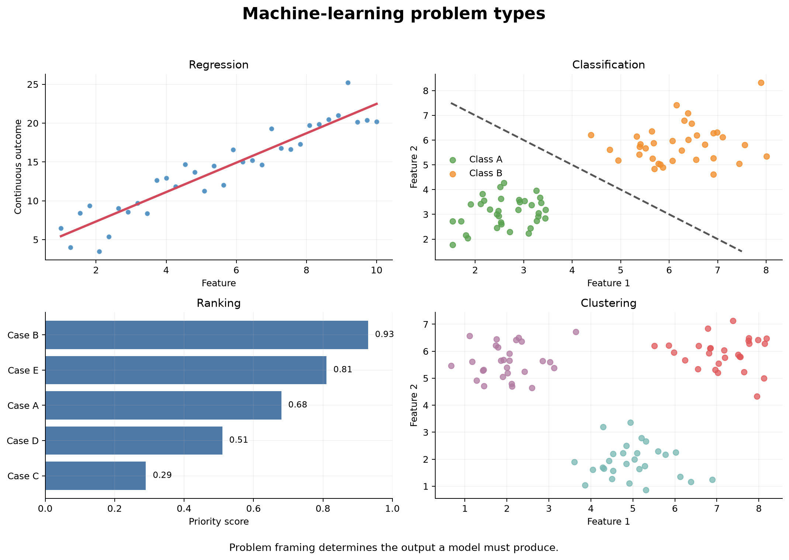

# Machine-Learning Thinking and Problem Types {#sec-ml-thinking-problem-types}

::: {.cdi-message}
- **ID:** MLPY-001
- **Type:** Conceptual and problem-framing chapter
- **Audience:** Learners beginning applied machine learning with Python
- **Theme:** Define the decision, prediction target, and evidence before choosing a model
:::

## Learning objectives

By the end of this chapter, you will be able to:

1. explain how machine-learning thinking differs from ordinary rule-based programming;
2. translate a broad real-world need into a precise prediction problem;
3. distinguish supervised, unsupervised, and other common learning settings;
4. identify regression, classification, ranking, clustering, and anomaly-detection tasks;
5. define the unit of observation, features, target, prediction time, and intended action;
6. recognize when a proposed problem is unsuitable for machine learning; and
7. write a concise problem statement that can guide data preparation and evaluation.

## Begin with the decision, not the algorithm

A machine-learning project rarely begins with a perfectly defined target. It usually begins with a broad request:

- Which customers may leave?
- Which patients need additional follow-up?
- How much demand should we expect next month?
- Which applications should be reviewed first?
- Are there unusual transactions in this stream?

These are useful starting points, but none is yet a complete machine-learning problem. Before data or models are selected, the team must determine what prediction will be made, when it will be made, what information will be available at that moment, and how the prediction will support an action.

::: callout-important
## A model output is not the final objective

The objective is usually a better decision or workflow. A probability, class label, score, cluster, or forecast is valuable only when someone can use it appropriately.
:::

Machine-learning thinking therefore begins with a chain of reasoning:

> **Need → decision → prediction → data available at prediction time → evaluation → action**

If any link is unclear, choosing an algorithm is premature.

## From traditional programming to learning from examples

In traditional programming, a developer writes explicit rules that transform inputs into outputs. In supervised machine learning, examples of inputs and known outcomes are used to estimate a function that can produce predictions for new inputs.

| Approach | Inputs | Human contribution | Output |
|---|---|---|---|
| Rule-based programming | Data and explicit rules | Write the decision logic | Deterministic result |
| Supervised learning | Features and known targets | Define the problem, data, model family, and evaluation | Learned prediction function |
| Unsupervised learning | Features without target labels | Define useful representations and validation criteria | Structure, groups, or unusual observations |

Machine learning does not remove human judgment. It changes where that judgment is applied. People still define the target, decide which records and variables are legitimate, choose evaluation criteria, interpret failures, and determine whether the output should influence a decision.

## The anatomy of a prediction problem

A well-formed supervised-learning problem contains several connected elements.

### Unit of observation

The unit of observation is the entity or event represented by one row at prediction time. It might be:

- one customer at the end of a month;
- one patient at hospital discharge;
- one loan application at submission;
- one machine at the beginning of a shift; or
- one product in one store on one date.

An unclear unit leads to duplicated observations, invalid splits, ambiguous targets, and misleading evaluation.

### Features

Features are the predictor variables available when the prediction is made. They may describe history, context, measurements, or derived summaries.

For a churn problem, legitimate features might include account age, recent service use, support interactions, and current subscription type. A cancellation reason recorded after departure would not be legitimate because it is unavailable at prediction time.

### Target

The target is the outcome the model is trained to predict. It must have an operational definition.

“Customer churn” is vague. A more useful target is:

> Whether an active customer cancels all paid services within 30 days after the prediction date.

This definition identifies the eligible population, event, and prediction horizon.

### Prediction time and horizon

The prediction time is the moment when features stop being collected and a prediction could be issued. The prediction horizon is the future period in which the target is observed.

These boundaries protect the analysis from leakage. If the prediction is made on 1 June, a variable recorded on 15 June cannot be used to predict an outcome during June.

### Intended action

The intended action explains how a prediction will be used. A churn score might trigger a service-quality review, a maintenance forecast might guide inspection scheduling, and a risk score might prioritize—not replace—professional assessment.

### Success criterion

Success must connect model performance to the use case. Accuracy alone may be unsuitable when classes are imbalanced or errors have unequal consequences. Evaluation might instead emphasize recall, precision, calibration, ranking quality, absolute error, subgroup performance, capacity, or cost.

## A reusable framing statement

Use the following structure before examining algorithms:

> Using **[information available by prediction time]**, predict **[target]** for **[unit of observation]** over **[prediction horizon]**, so that **[user]** can **[action]**. Evaluate success using **[metric and operational criterion]**, while checking **[important risks or subgroup constraints]**.

For example:

> Using customer information available at the end of each month, predict whether each active subscriber will cancel all paid services within the next 30 days, so that the customer-care team can prioritize a limited number of service reviews. Evaluate ranking, recall at available capacity, probability calibration, and performance across regions and subscription types.

This statement is more useful than “build a churn model” because it determines data eligibility, target construction, splitting, evaluation, and deployment requirements.

## Learning settings

### Supervised learning

Supervised learning uses examples for which the target is known. The model learns a relationship between features $X$ and target $y$ and is evaluated on observations not used to fit it.

Common supervised tasks include regression, classification, and ranking.

### Unsupervised learning

Unsupervised learning examines data without a labelled target. It may be used to find groups, lower-dimensional representations, or unusual observations.

Because there may be no single correct answer, validation must combine quantitative diagnostics, stability, domain usefulness, and careful interpretation. A cluster is a mathematical grouping, not automatically a real-world category.

### Semi-supervised and self-supervised learning

Semi-supervised learning combines a small amount of labelled data with a larger amount of unlabelled data. Self-supervised learning constructs learning signals from the data itself, often to learn reusable representations. These approaches are important but require design choices beyond this guide's main focus on structured supervised learning.

### Reinforcement learning

Reinforcement learning concerns an agent choosing actions and learning from rewards over time. Actions can change future observations, so the problem differs fundamentally from learning from a fixed table of labelled examples.

## Common machine-learning problem types

{#fig-ml-problem-types fig-alt="Four panels show a fitted line for a continuous outcome, two coloured classes separated by a decision boundary, applicants ordered by a priority score, and three unlabeled groups of observations." width=100%}

The visual summary in @fig-ml-problem-types shows that problem types differ in the form of the desired output. Generate it from the repository root with:

```bash
bash scripts/bash/01-generate-ml-problem-types.sh
```

### Regression

Regression predicts a continuous numeric quantity.

Examples include:

- monthly demand;
- delivery time;
- energy consumption;
- crop yield; and
- expected treatment cost.

A regression target must have a meaningful unit. Evaluation should express the size and consequence of errors, not only a dimensionless score. Mean absolute error, root mean squared error, and prediction intervals answer different questions.

### Classification

Classification predicts membership in one of two or more categories.

Examples include:

- cancellation versus continued service;
- fraudulent versus legitimate transaction;
- disease category;
- document topic; and
- equipment failure type.

Many classifiers first estimate scores or probabilities. A decision threshold then converts those values into labels. The threshold is part of the decision policy, not an immutable property of the model.

### Ranking

Ranking orders observations by relevance, priority, or expected value. It is useful when only a limited number of cases can be reviewed or served.

Examples include:

- prioritizing applications for manual review;
- ordering search results;
- recommending products; and
- identifying the highest-risk equipment for inspection.

A ranking problem may use a classifier internally, but its operational evaluation should reflect the ordered list—for example, recall among the top 100 cases.

### Clustering

Clustering groups observations using patterns in their features without a known target label.

Examples include exploratory customer segmentation, grouping gene-expression profiles, or discovering patterns of service use. Results depend on feature selection, scaling, distance, and the clustering algorithm. Groups must be tested for stability and usefulness before being assigned real-world meaning.

### Anomaly detection

Anomaly detection identifies observations that differ from an expected pattern. It may be supervised when labelled anomalies exist or unsupervised when they do not.

Unusual does not necessarily mean harmful. Rare legitimate transactions, new customer behaviour, and data-quality errors may all receive high anomaly scores. Human review and feedback are often essential.

### Forecasting

Forecasting predicts future values indexed by time. It is related to regression but must respect temporal order, changing trends, seasonality, autocorrelation, and the forecast horizon. Random train-test splitting is usually inappropriate.

## One request can contain several possible problems

Consider the request: “Use data to improve customer retention.” It could lead to different tasks.

| Refined question | Problem type | Output | Possible action |
|---|---|---|---|
| Who is likely to cancel within 30 days? | Binary classification | Probability of cancellation | Prioritize service review |
| Which customers should be contacted first? | Ranking | Ordered priority list | Allocate limited outreach capacity |
| How many cancellations should we expect next month? | Forecasting | Monthly count or rate | Plan staffing and revenue |
| What common usage patterns exist? | Clustering | Exploratory groups | Form hypotheses for service design |
| Which accounts show unusual changes? | Anomaly detection | Anomaly score | Investigate data or service issues |

The correct formulation depends on the decision. The same dataset can support several analyses, but they should not be confused with one another.

## Prediction is not causal inference

A predictive model estimates outcomes from patterns in observed data. It does not by itself tell us what would happen if an intervention were applied.

A churn model may identify customers with many support calls as high risk. That does not imply that reducing recorded calls would prevent churn. Calls may reflect unresolved problems rather than cause them.

Use predictive language when the goal is prediction:

- “is associated with higher predicted risk”;
- “contributes to the model's prediction”; or
- “helps distinguish observations in these data.”

Questions about the effect of an intervention require causal assumptions, study design, and methods appropriate to causal inference.

## When machine learning may not be appropriate

Machine learning is not automatically justified because data exist. Reconsider the project when:

- a clear deterministic rule already solves the problem;
- too few relevant examples exist;
- the target cannot be measured reliably;
- available features occur after the decision;
- historical decisions reproduce unacceptable bias;
- the environment changes too quickly for past patterns to remain useful;
- no meaningful action follows from the prediction;
- the cost of errors is unacceptable; or
- a simpler descriptive or statistical analysis answers the real question.

::: callout-tip
## Prefer the simplest adequate solution

A well-designed rule, summary, or small statistical model may be more transparent, stable, and maintainable than a complex machine-learning system.
:::

## Leakage begins during problem framing

Leakage occurs when model development uses information that would not legitimately be available for future predictions. It can enter through:

- post-outcome variables;
- preprocessing fitted before data splitting;
- repeated entities placed across training and test sets;
- future records used to predict the past;
- target-derived features; or
- selecting models repeatedly against the final test set.

The best defence begins before coding: draw the prediction-time boundary and ask when every candidate feature becomes available.

## A problem-framing checklist

Before proceeding, document:

### Purpose

- What decision or workflow needs support?
- Who will use the output?
- What action is possible?

### Prediction

- What is the unit of observation?
- What exactly is the target?
- When is the prediction made?
- What is the prediction horizon?

### Data

- Which features are available at prediction time?
- How were observations and targets measured?
- Which population is represented or excluded?
- Could records from the same entity appear more than once?

### Evaluation

- What simple baseline must the model outperform?
- Which errors matter most?
- What metric reflects the intended use?
- Which subgroups require separate assessment?
- What level of performance would make the output useful?

### Responsibility

- Could the prediction deny, delay, or prioritize access to an important service?
- Could historical patterns reproduce inequity?
- Is human review required?
- How will uncertainty and limitations be communicated?

## Practice: frame the problem before choosing a model

For each request, identify the likely unit, target or output, prediction time, problem type, and action.

1. A clinic wants to reduce missed appointments.
2. A nursery wants to estimate weekly demand for flowering plants.
3. A laboratory wants to flag unusual sample measurements before reporting results.
4. A support team can contact only 50 accounts each day and wants to focus on urgent cases.

There can be more than one defensible formulation. The important step is to make each assumption explicit.

For example, the clinic request could become:

> Using information recorded by 18:00 on the day before an appointment, predict whether each scheduled visit will be missed, so that clinic staff can prioritize reminder calls the following morning. Evaluate recall among the number of calls staff can make, precision, calibration, and performance across clinic locations and patient groups.

## Chapter checklist

- [ ] I can begin a project with the decision and action rather than an algorithm.
- [ ] I can define the unit of observation, features, target, prediction time, and horizon.
- [ ] I can distinguish regression, classification, ranking, clustering, anomaly detection, and forecasting.
- [ ] I understand why a prediction does not establish a causal effect.
- [ ] I can identify early signs of leakage or an unsuitable machine-learning problem.
- [ ] I can write a complete framing statement with an evaluation criterion.

## Key takeaways

- Machine learning is a decision-support workflow, not simply a collection of estimators.
- A strong problem definition specifies the unit, target, prediction time, horizon, available features, intended user, and action.
- The desired output determines whether the task is regression, classification, ranking, clustering, anomaly detection, forecasting, or another problem type.
- Evaluation must reflect the real use of the model and the consequences of its errors.
- Leakage, bias, and unusable predictions often originate in problem framing, before any model is fitted.
- A simpler rule or analysis is preferable when machine learning does not add dependable value.

## Looking ahead

The next chapter turns this reasoning into a reproducible working environment. You will establish the repository structure, create a dedicated Python environment, confirm package versions, and learn how the guide separates non-executing chapter examples from complete scripts that generate documented results.
