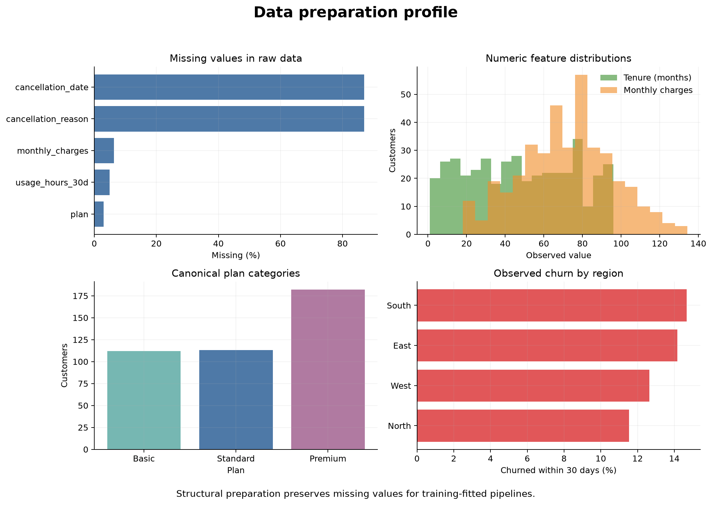

# Data Preparation for Machine Learning {#sec-data-preparation-ml}

::: {.cdi-message}
- **ID:** MLPY-002
- **Type:** Data preparation and leakage-prevention chapter
- **Audience:** Learners preparing structured tabular data for predictive modelling
- **Theme:** Build trustworthy model inputs without allowing future or held-out information to influence training
:::

## Learning objectives

By the end of this chapter, you will be able to:

1. distinguish general data cleaning from model-specific preprocessing;
2. define the modelling population, observation unit, target, and prediction-time boundary;
3. identify duplicate records, invalid values, inconsistent categories, missing data, and leakage-prone fields;
4. decide which preparation steps may be applied before splitting and which must be learned from training data only;
5. preserve raw data while producing an auditable modelling table;
6. assign appropriate roles to identifiers, features, targets, grouping variables, timestamps, and audit fields; and
7. document a reproducible data-preparation workflow for later modelling chapters.

## From a prediction problem to a modelling table

Chapter 01 established that machine learning begins with a decision, not an algorithm. Once the unit of observation, target, prediction time, horizon, and intended action are defined, the next task is to construct the table that represents that problem faithfully.

A modelling table is not merely a cleaned spreadsheet. Each row must represent the stated unit at the prediction time, each candidate feature must be legitimately available at that time, and the target must be defined consistently over the future prediction horizon.

For a monthly customer-retention problem, one row might represent:

> One active customer at the final day of a month, using information recorded by that date, with a target indicating whether the customer cancels within the following 30 days.

That definition determines which records are eligible, how repeated customer histories are handled, which dates matter, and which columns are prohibited.

::: callout-important
## Data preparation is part of model validity

A sophisticated estimator cannot repair an incorrectly defined row, a target measured inconsistently, or a feature recorded after the outcome. Preparation choices determine what the model is actually allowed to learn.
:::

## Three layers of preparation

It is useful to separate data preparation into three layers.

### Structural preparation

Structural preparation makes the data internally coherent without estimating patterns from the modelling sample. Typical steps include:

- assigning stable column names and data types;
- parsing dates with explicit rules;
- standardizing known spelling variants;
- enforcing documented units;
- identifying impossible values;
- removing confirmed duplicate records;
- defining the eligible population;
- constructing the target from approved source fields; and
- removing fields known to occur after prediction time.

These rules should come from the data specification and problem definition, not from the distribution of the future test set.

### Learned preprocessing

Learned preprocessing estimates values or parameters from data. Examples include:

- median or most-frequent imputation;
- means and standard deviations for scaling;
- category vocabularies for encoding;
- feature-selection thresholds;
- transformations chosen after inspecting distributions; and
- outlier thresholds estimated from sample quantiles.

These steps must be fitted on training data only and later applied unchanged to validation and test data. Scikit-learn pipelines provide the safest general mechanism, which we develop in a later chapter.

### Evaluation-specific preparation

Some preparation decisions belong to evaluation design:

- grouping repeated observations from the same person or organization;
- preserving temporal order;
- stratifying a classification split;
- defining geographic or organizational holdouts; and
- reserving the final test set from all model-selection decisions.

These choices must be planned before exploratory modelling because they determine which observations may legitimately inform one another.

## The preparation boundary

The central rule is:

> Apply fixed, documented validity rules to the full source data when appropriate, but fit any data-dependent transformation using training data only.

| Preparation step | Before splitting? | Reason |
|---|---:|---|
| Rename columns using a data dictionary | Yes | Fixed structural rule |
| Parse a documented date format | Yes | Fixed structural rule |
| Standardize `premium`, `Premium`, and `PREMIUM` | Yes | Known semantic equivalence |
| Remove exact duplicate extracts | Usually | Corrects duplicated records, if confirmed |
| Replace impossible negative tenure with missing | Yes | Fixed validity constraint |
| Drop a post-cancellation reason field | Yes | Known leakage field |
| Estimate median for missing income | No | Median must come from training data |
| Learn scaling mean and standard deviation | No | Parameters must come from training data |
| Choose rare-category threshold from frequencies | No | Frequency is sample-dependent |
| Select features using association with target | No | Selection must occur inside validation |

This distinction prevents a common error: creating a perfectly clean table by using information from all observations, then pretending the test set remained unseen.

## Audit the data before changing it

Begin with a read-only audit. Record what exists before applying corrections.

### Shape and observation unit

Confirm:

- the number of rows and columns;
- whether one row really represents the intended unit;
- whether entities appear more than once;
- whether repeated rows are duplicates or legitimate snapshots; and
- whether the date coverage matches the prediction design.

An identifier duplicated across months may be expected. The same identifier and snapshot date repeated with identical values may indicate duplicate extraction.

### Column roles

Assign every column a role.

| Role | Purpose | Typical treatment |
|---|---|---|
| Identifier | Links or distinguishes entities | Preserve for audit; usually exclude as feature |
| Feature | Supplies information available at prediction time | Evaluate quality and modelling treatment |
| Target | Defines the outcome | Validate definition, timing, and missingness |
| Time | Establishes ordering and prediction boundary | Parse and retain for splitting or auditing |
| Group | Identifies related observations | Use in grouped splitting or subgroup checks |
| Audit | Supports traceability | Retain outside the feature matrix |
| Leakage field | Reveals outcome or post-prediction information | Exclude from modelling inputs |

Do not drop identifiers immediately. They are often essential for detecting duplicates, preventing entity overlap, tracing errors, and joining predictions back to source records.

### Data types and domains

A numeric storage type does not guarantee a quantitative meaning. Postal code, product code, and disease stage may be stored as integers but require categorical or ordinal treatment.

For each field, document:

- semantic type;
- storage type;
- unit;
- valid range or allowed values;
- missing-value codes;
- availability time; and
- intended model role.

### Missingness

Measure missingness by column and, when relevant, by time, source, location, or subgroup. Missing values can arise because:

- measurement was not attempted;
- a question was not applicable;
- collection failed;
- a system changed;
- a value was suppressed; or
- an invalid value was converted to missing.

These mechanisms have different implications. A single imputation rule should not be chosen before the reasons are understood.

### Categories

Inspect distinct values, whitespace, letter case, spelling, unexpected codes, and rare levels. Standardize categories only when the values are known to mean the same thing. Do not merge categories merely because one is uncommon.

### Numeric values

Inspect ranges, quantiles, units, impossible values, and suspicious spikes. An extreme value may be a valid observation, a unit error, or a data-entry problem. Treating every statistical outlier as an error removes precisely the cases a model may need to understand.

## A reproducible preparation workbench

The chapter workflow creates a synthetic customer snapshot table containing realistic quality problems, applies fixed structural rules, and preserves missing values for later pipeline-based preprocessing.

Run it from the repository root:

```bash
bash scripts/bash/02-prepare-ml-data.sh
```

The script writes:

```text
data/raw/02-customer-retention-raw.csv
data/processed/02-customer-retention-ml-ready.csv
results/figures/02-data-preparation-profile.png
results/tables/02-data-quality-summary.csv
results/tables/02-feature-readiness-summary.csv
```

{#fig-data-preparation-profile fig-alt="Four panels show missing percentages before structural cleaning, distributions of tenure and monthly charges, counts for standardized plan categories, and churn percentages across regions." width=100%}

The profile in @fig-data-preparation-profile is a diagnostic artifact, not a modelling result. It helps the analyst verify that structural preparation behaved as intended and identify decisions that must be deferred until after splitting.

## Preserve raw data and create traceable outputs

Raw source data should remain unchanged. A reproducible project normally separates:

```text
data/
├── raw/
├── processed/
└── reference/
```

- `data/raw/` stores immutable source extracts or reproducibly generated examples.
- `data/processed/` stores tables created through documented code.
- `data/reference/` stores data dictionaries, code lists, mappings, and other supporting definitions.

Never manually edit the raw CSV and save over it. If a correction is justified, express it in code so it can be reviewed, tested, and applied again.

## Duplicates require a definition

The word “duplicate” can describe different situations:

1. **Exact duplicate:** every field is repeated because a row was ingested twice.
2. **Duplicate key:** the supposed unique identifier appears more than once.
3. **Repeated observation:** the same entity is legitimately measured at several times.
4. **Near duplicate:** records probably refer to the same entity but disagree in some fields.

Only the first case can often be removed mechanically. Duplicate keys and near duplicates require domain rules. Repeated observations may be essential and may require grouped or temporal splitting rather than deletion.

The chapter script removes only confirmed duplicate customer snapshots—rows with the same customer and snapshot date that are otherwise identical.

## Invalid values should become explicit

When a value violates a documented constraint, do not silently force it into range. Convert it to a clearly recorded missing value or quarantine the record, depending on the meaning and severity.

Examples include:

- negative account tenure;
- charges below zero;
- an end date before a start date;
- a category outside the approved code list; and
- a target that cannot be mapped to its documented definition.

The correction rule should be visible in code and counted in a quality summary. Later imputation is a separate modelling decision.

## Standardize categories deliberately

Known variants can be mapped to one canonical representation:

```python
plan_map = {
    "basic": "Basic",
    "BASIC": "Basic",
    "premium": "Premium",
    "Premium ": "Premium",
}

customers["plan"] = customers["plan"].map(plan_map)
```

This example is intentionally displayed rather than executed in the chapter. The complete implementation is in `scripts/python/02-prepare-ml-data.py`.

Unknown values should not be guessed into the nearest category. Preserve them as missing or an explicitly documented `Unknown` level according to the data specification and modelling purpose.

## Protect the prediction-time boundary

For every candidate feature, ask:

> Could this value be known, in this form, at the exact moment the prediction would be issued?

Fields such as `cancellation_date`, `cancellation_reason`, final account status, completed treatment outcome, or a manually assigned post-review code may reveal the target.

Leakage can also hide inside aggregates. “Number of support calls in the next 30 days” is future information. “Number of support calls in the 30 days before the snapshot” may be legitimate if it can be computed at prediction time.

The chapter workflow retains leakage fields in the raw example so learners can recognize them, but excludes them from the processed modelling table.

## Handle missing values after splitting

The processed table produced in this chapter intentionally retains missing numeric and categorical values. It does not fill them using medians, means, modes, or learned categories.

This is correct because an imputer must learn its replacement values from the training partition only. The fitted imputer is then applied unchanged to validation and test data.

Conceptually:

```python
from sklearn.impute import SimpleImputer

imputer = SimpleImputer(strategy="median")
imputer.fit(X_train[["monthly_charges"]])

X_train_charges = imputer.transform(X_train[["monthly_charges"]])
X_test_charges = imputer.transform(X_test[["monthly_charges"]])
```

In practice, the imputer should be placed inside a scikit-learn pipeline so that cross-validation repeats the fitting correctly within every training fold.

## Separate the audit table from the feature matrix

A processed modelling table may contain columns that should not enter the estimator directly:

- `customer_id` for traceability and grouped splitting;
- `snapshot_date` for temporal splitting;
- `region` for subgroup evaluation, even if it is excluded from training;
- source-system fields for auditing; and
- the target column.

The feature matrix $X$ and target vector $y$ should therefore be selected explicitly rather than created by “dropping whatever looks unnecessary.”

```python
feature_columns = [
    "tenure_months",
    "monthly_charges",
    "support_calls_30d",
    "usage_hours_30d",
    "plan",
    "contract_type",
]

X = customers[feature_columns]
y = customers["churned_30d"]
```

Explicit selection makes the modelling contract reviewable and reduces the risk of accidentally including an identifier or leakage field.

## Create quality and readiness summaries

The workflow produces two complementary tables.

### Data-quality summary

The quality summary records issues found and structural actions taken, such as:

- exact duplicate snapshots removed;
- invalid tenure values converted to missing;
- invalid charges converted to missing;
- category variants standardized; and
- post-outcome leakage columns excluded.

### Feature-readiness summary

The readiness summary records each processed column's role, type, missingness, and next modelling action. It makes clear that “processed” does not mean “ready to pass directly into every estimator.”

For example, a numeric feature with missing values may be structurally valid but still require a training-fitted imputer. A categorical feature may require one-hot encoding inside a pipeline. An identifier may be ready for audit but prohibited as a predictor.

## Common preparation failures

### Cleaning without preserving evidence

Overwriting the raw source removes the ability to reconstruct or challenge a correction. Preserve the source and write processed outputs separately.

### Imputing before the split

Using the full dataset to estimate replacement values allows validation and test observations to influence training. Fit imputation inside the training workflow.

### Treating all identifiers as useless

Identifiers usually should not be predictors, but they remain valuable for duplicate checks, grouping, traceability, and joining predictions back to records.

### Dropping every incomplete row

Complete-case analysis can remove large or systematically different groups. Investigate missingness before deciding whether exclusion is defensible.

### Removing every outlier

Extreme observations may be valid and important. Use domain constraints to identify impossibilities; treat statistical unusualness as a diagnostic, not automatic proof of error.

### Encoding categories manually before validation

Building dummy variables or category dictionaries from the full dataset can expose held-out category information. Let a pipeline learn encodings from training data and handle unseen levels deliberately.

### Allowing post-outcome fields into features

A highly predictive field may simply reveal the outcome. Availability at prediction time is more important than correlation with the target.

## A preparation decision record

For every material change, record:

| Field | Question |
|---|---|
| Issue | What was observed? |
| Evidence | Why is it invalid, inconsistent, or risky? |
| Rule | What correction or exclusion is applied? |
| Scope | Which rows or columns are affected? |
| Timing | Is the rule fixed, or must it be fitted after splitting? |
| Impact | How many observations or values changed? |
| Verification | How was the result checked? |

This record prevents preparation from becoming an undocumented sequence of convenient edits.

## Practice: decide when the step belongs

For each proposed action, decide whether it is a structural rule, a training-fitted transformation, an evaluation-design decision, or an unjustified action.

1. Map `PREM`, `premium`, and `Premium ` to the documented `Premium` plan.
2. Fill missing charges with the median of all available rows.
3. Keep all monthly snapshots from one customer in the same evaluation group.
4. Drop customers with unusually high support use because they distort the distribution.
5. Remove `cancellation_reason` from features used to predict cancellation.
6. Learn one-hot categories independently inside each cross-validation training fold.

Defensible answers are:

1. structural rule, if the equivalence is documented;
2. training-fitted transformation—the full-data median is leakage;
3. evaluation-design decision;
4. unjustified without evidence that the values are invalid;
5. structural exclusion based on prediction-time availability; and
6. training-fitted transformation implemented through a pipeline.

## Chapter checklist

- [ ] I can define the observation unit and prediction-time boundary before cleaning.
- [ ] I can assign each column a modelling or audit role.
- [ ] I understand the difference between fixed structural rules and learned preprocessing.
- [ ] I preserve raw data and generate processed outputs through code.
- [ ] I do not impute, scale, encode, or select features using the complete dataset.
- [ ] I retain identifiers and timestamps needed for splitting, auditing, and traceability.
- [ ] I can document preparation decisions and their impact.

## Key takeaways

- A modelling table must represent the prediction problem at the correct unit and time.
- Structural cleaning and learned preprocessing are different stages with different leakage risks.
- Fixed validity rules may be applied reproducibly, while data-dependent transformations must be fitted on training data only.
- Raw data should remain immutable; processed data, quality summaries, and figures should be generated by code.
- Missing values and extreme observations require investigation, not automatic deletion or global imputation.
- Identifiers, timestamps, group fields, and audit columns may be essential even when they are excluded from the estimator.
- Explicit feature selection is safer than allowing every remaining column into a model.

## Looking ahead

The next chapter turns the prediction problem into a trustworthy modelling table. You will audit data quality, assign column roles, distinguish structural cleaning from training-fitted preprocessing, preserve raw data, and prevent leakage while preparing reproducible model inputs.