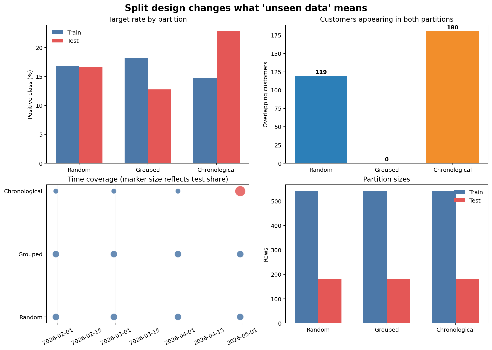

# Data Splitting and Leakage Prevention {#sec-data-splitting-leakage}

::: {.cdi-message}
- **ID:** MLPY-003
- **Type:** Validation design and leakage-prevention chapter
- **Audience:** Learners building trustworthy machine-learning evaluations with structured data
- **Theme:** Make the evaluation population resemble future use while keeping unavailable information out of training
:::

## Learning objectives

By the end of this chapter, you will be able to:

1. explain the distinct purposes of training, validation, and test data;
2. translate a deployment scenario into a defensible splitting strategy;
3. choose among random, stratified, grouped, and time-based splits;
4. detect entity overlap, time-order violations, target leakage, and preprocessing leakage;
5. keep the final test set outside model development; and
6. produce an auditable record of split assignments and diagnostics.

## Evaluation begins before modelling

A model evaluation answers a future-facing question: how well will this workflow perform on observations it did not use to learn? A split is therefore not an administrative step. It is a simulation of deployment.

Suppose a retention model will score customers at the end of each month. Several evaluation questions are possible:

- How well will it score new records from customers already known to the organization?
- How well will it generalize to entirely new customers?
- How well will a model trained today perform in a later month?

Those questions require different splits. A convenient random split can be statistically tidy and still answer the wrong operational question.

::: callout-important
## State the generalization target first

Write down what must be new at deployment: a new row, a new entity, a later time period, a new site, or some combination. Then choose the split that keeps that boundary intact.
:::

## The three data roles

### Training data

Training data are used to estimate model parameters and every learned preprocessing parameter. Imputation values, scaling statistics, category vocabularies, feature selection, and the estimator itself all learn from this partition.

### Validation data

Validation data support model development. They may be used to compare algorithms, tune hyperparameters, select thresholds, and refine features. Cross-validation repeatedly creates training and validation folds within the development data.

### Test data

The test set provides the final estimate for the selected workflow. It must not guide feature engineering, preprocessing choices, model selection, hyperparameter tuning, or threshold selection.

Repeatedly checking the test score turns the test set into another validation set. If that happens, a new untouched test set is needed for an honest final estimate.

## Choose a split that matches deployment

| Deployment question | Appropriate starting strategy | Boundary protected |
|---|---|---|
| New independent rows from the same stable population | Random split | Observation |
| Classification with an uncommon target | Stratified random split | Observation and approximate class balance |
| New patients, customers, devices, schools, or sites | Grouped split | Entity or organization |
| Later periods after training | Time-based split | Time |
| Later periods for previously unseen entities | Grouped time design | Entity and time |

### Random and stratified random splits

A random split assumes rows are exchangeable: after accounting for the sampled features, one row does not carry special information about another. Stratification preserves the target proportion approximately across partitions and is often useful for classification.

Stratification does not prevent leakage. If the same customer appears in both partitions, a stratified split may still produce an overly optimistic estimate.

### Grouped splits

A grouped split keeps every row belonging to one entity in a single partition. Use it when repeated observations, related samples, or shared environments create dependence.

Common grouping units include:

- customer, patient, household, or account;
- machine, device, or production batch;
- school, hospital, branch, or geographic area; and
- document, speaker, or source system.

The group must represent the unit that should be unfamiliar at deployment.

### Time-based splits

A time-based split trains on earlier observations and evaluates on later observations. It is appropriate when production predictions move forward through time and conditions may drift.

The boundary should include any operational delay. If labels take 30 days to mature, training data immediately before the cutoff may not yet have observable outcomes. A gap between training and evaluation can reproduce that constraint.

Entity overlap in a time split is not automatically an error. It is valid when the future task scores later records for known entities. It is invalid when the intended task is generalization to unseen entities. The deployment question decides.

## A reproducible split-audit workbench

The chapter workflow creates repeated monthly customer snapshots and compares three candidate designs:

1. a stratified random split;
2. a customer-grouped split; and
3. a chronological holdout using the latest month.

Run it from the repository root:

```bash
bash scripts/bash/03-audit-data-splits.sh
```

The workflow writes:

```text
data/processed/03-customer-snapshots.csv
results/figures/03-splitting-strategies.png
results/tables/03-split-assignments.csv
results/tables/03-split-audit.csv
```

{#fig-splitting-strategies fig-alt="Four panels compare target rates, customer overlap, chronological coverage, and row counts for stratified random, customer-grouped, and chronological holdout strategies." width=100%}

The audit in @fig-splitting-strategies makes trade-offs visible. The grouped split prevents customer overlap. The chronological split preserves the arrow of time. The random split approximately preserves class balance, but repeated customers appear on both sides of its boundary.

## Build each split explicitly

The complete implementation is in `scripts/python/03-audit-data-splits.py`. The essential patterns are shown here as non-executable examples.

### Stratified random split

```python
from sklearn.model_selection import train_test_split

train_index, test_index = train_test_split(
    data.index,
    test_size=0.25,
    stratify=data["churned_next_month"],
    random_state=42,
)
```

Fixing `random_state` makes the assignment reproducible. It does not make the design valid; validity still depends on the independence of rows.

### Grouped split

```python
from sklearn.model_selection import GroupShuffleSplit

splitter = GroupShuffleSplit(
    n_splits=1,
    test_size=0.25,
    random_state=42,
)

train_position, test_position = next(
    splitter.split(data, groups=data["customer_id"])
)
```

Scikit-learn returns row positions here. The workbench converts them to index labels before recording assignments.

### Chronological holdout

```python
cutoff = data["snapshot_date"].max()
train_index = data.index[data["snapshot_date"] < cutoff]
test_index = data.index[data["snapshot_date"] >= cutoff]
```

In a real project, choose the cutoff from the evaluation design rather than simply using the latest available date. Confirm that training labels and every feature would have been available before that boundary.

## Audit the assignments

A split should be tested as data, not trusted because the code ran. At minimum, record:

- row counts and target rates by partition;
- entity counts and entity overlap;
- minimum and maximum dates;
- whether training precedes evaluation when time order is required;
- missing targets or group identifiers; and
- the random seed, cutoff date, and splitting method.

An entity-overlap assertion for a grouped design is simple:

```python
train_customers = set(train_data["customer_id"])
test_customers = set(test_data["customer_id"])

assert train_customers.isdisjoint(test_customers)
```

For a chronological design, verify the time boundary:

```python
assert train_data["snapshot_date"].max() < test_data["snapshot_date"].min()
```

Assertions convert design requirements into executable checks. If an upstream data refresh violates an assumption, the workflow should fail visibly.

## Recognize the main forms of leakage

### Target leakage

A feature directly or indirectly reveals the outcome. A cancellation reason, final account status, or refund issued after cancellation can make churn prediction appear effortless.

### Prediction-time leakage

A feature exists in the dataset but was not available when the prediction would have been made. Timestamps and source-system histories are essential for checking availability.

### Preprocessing leakage

Statistics are learned from validation or test data. Computing a global median, scaling the complete dataset, or selecting features before cross-validation allows held-out observations to influence training.

The safe order is:

1. define the evaluation design;
2. assign rows to partitions;
3. fit learned preprocessing on the training partition;
4. apply the fitted transformations to validation or test data; and
5. evaluate without refitting on held-out observations.

### Group leakage

Related observations occur in different partitions. The model may recognize an entity or its environment instead of learning a relationship that generalizes.

### Temporal leakage

Future observations, future-derived aggregates, or revised records influence earlier predictions. A random split of time-dependent data is a common cause.

### Test-set leakage through iteration

The analyst repeatedly adapts the workflow after viewing test performance. No column has crossed the boundary, but information from the test results has influenced development.

## Split before learned preprocessing

The following sequence leaks because the imputer sees all rows:

```python
data["income"] = data["income"].fillna(data["income"].median())
train_data, test_data = train_test_split(data, test_size=0.25)
```

Instead, split first and place learned transformations in a pipeline:

```python
from sklearn.impute import SimpleImputer
from sklearn.pipeline import make_pipeline

workflow = make_pipeline(
    SimpleImputer(strategy="median"),
    model,
)

workflow.fit(X_train, y_train)
predictions = workflow.predict(X_test)
```

During cross-validation, the entire pipeline must be passed to the validation routine so each fold learns preprocessing from its own training portion.

## Preserve a final test set

A professional workflow commonly uses two levels:

- reserve the final test set according to the deployment boundary; and
- perform model selection with validation or cross-validation inside the remaining development data.

After selecting the workflow, refit it on all permitted development data and evaluate it once on the test set. Report the split definition alongside the metric so readers know what kind of generalization was measured.

## A split-design checklist

Before modelling, confirm:

- [ ] The intended prediction time and horizon are documented.
- [ ] The population represented by the test set matches intended use.
- [ ] Repeated or related observations have an explicit grouping policy.
- [ ] Time order and label-availability delays are respected.
- [ ] Learned preprocessing is fitted inside the training workflow.
- [ ] The test set is excluded from model and threshold selection.
- [ ] Split assignments can be reproduced from code and saved metadata.
- [ ] Automated checks detect overlap and boundary violations.

## Key takeaways

- A data split is a simulation of deployment, not merely a percentage allocation.
- Random stratification preserves class balance but does not prevent entity or temporal leakage.
- Grouped splitting protects the boundary around related observations.
- Chronological splitting protects future evaluation, but entity overlap must still match the use case.
- Learned preprocessing belongs inside the training and validation workflow.
- A final test set remains informative only while it is isolated from development decisions.
- Saved assignments, diagnostics, and assertions make evaluation design auditable.

## Looking ahead

With a defensible evaluation boundary in place, the next chapter establishes simple baselines and trains the first classification and regression models. Those models will provide reference points for judging whether additional complexity produces a meaningful improvement.
