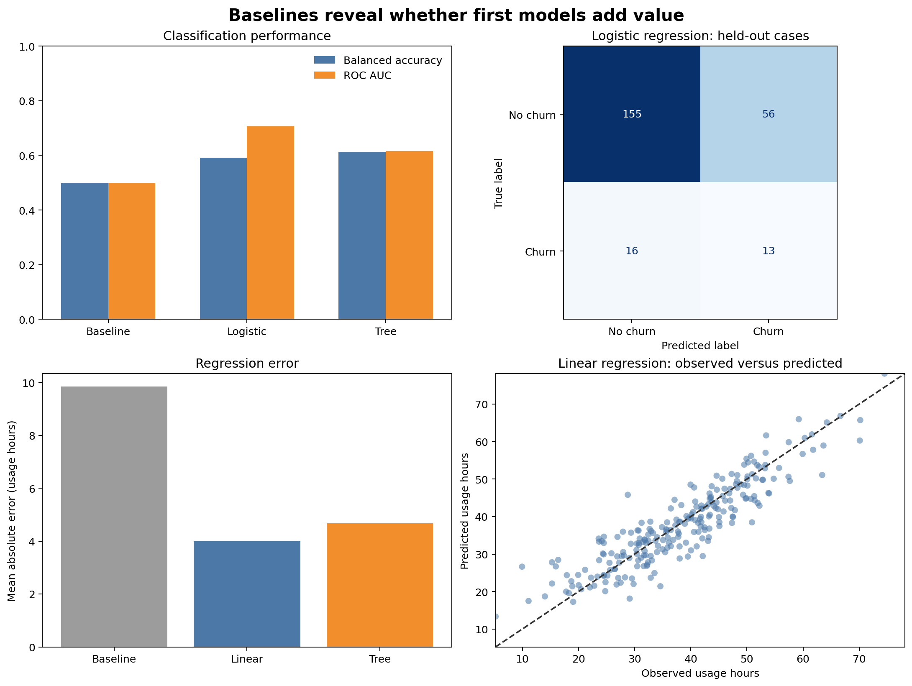

# Baselines and First Models {#sec-baselines-first-models}

::: {.cdi-message}
- **ID:** MLPY-004
- **Type:** Baseline modelling and first-estimator chapter
- **Audience:** Learners moving from validated data splits to reproducible supervised models
- **Theme:** Establish honest reference performance before increasing model complexity
:::

## Learning objectives

By the end of this chapter, you will be able to:

1. explain why every modelling task needs a baseline;
2. construct appropriate classification and regression baselines;
3. build end-to-end scikit-learn pipelines for mixed tabular data;
4. train simple linear and tree-based models;
5. compare models using metrics that match the prediction problem; and
6. interpret improvement relative to the baseline without overclaiming.

## Start with the easiest credible competitor

A trained model is useful only if it improves on a sensible alternative. The first comparison should therefore be against a baseline, not against another sophisticated model.

For classification, a baseline might always predict the most common class or reproduce the class distribution. For regression, it might always predict the training mean or median. A business rule, existing scoring process, or previous model may provide an even stronger operational baseline.

::: callout-important
## A baseline is a required control

If a complex model cannot beat a simple baseline on untouched data, additional complexity has not created predictive value. Diagnose the data, target, split, features, and metric before tuning the model.
:::

## Continue from the evaluation design

Chapter 03 established that the split must simulate deployment. This chapter uses a chronological holdout: the first three monthly customer snapshots form the training partition and the final month forms the test partition.

The model-development sequence is now:

1. define the prediction problem and metric;
2. preserve the evaluation boundary;
3. build a baseline pipeline;
4. build one or two simple candidate pipelines;
5. fit using training data only;
6. evaluate all candidates on the same held-out rows; and
7. record results and modelling assumptions.

The test set is used here for teaching the comparison. In a larger project, model choice and tuning would occur with validation or cross-validation inside the development data, followed by one final test evaluation.

## Two supervised-learning tasks

The workbench uses one synthetic customer-snapshot table to demonstrate two common tasks.

### Classification

Predict whether a customer will churn during the following month. The target is binary: `churned_next_month`.

### Regression

Predict the customer's usage during the following month. The target is continuous: `next_month_usage_hours`.

The two tasks share predictors but require different estimators, baselines, metrics, and interpretations.

## Select metrics before viewing results

### Classification metrics

| Metric | What it measures | Important limitation |
|---|---|---|
| Accuracy | Overall proportion classified correctly | Can hide failure on an uncommon class |
| Balanced accuracy | Average recall across classes | Does not assess probability quality |
| ROC AUC | Ranking of positive cases above negative cases | May appear strong when operational precision is poor |
| Log loss | Quality and confidence of predicted probabilities | Sensitive to confidently wrong predictions |

This chapter reports accuracy, balanced accuracy, and ROC AUC. No single metric should be interpreted without the class distribution and intended decision.

### Regression metrics

| Metric | What it measures | Interpretation |
|---|---|---|
| MAE | Average absolute prediction error | Same units as the target |
| RMSE | Square-root of average squared error | Penalizes larger errors more strongly |
| R² | Improvement over predicting the mean | Can be negative on held-out data |

MAE is the primary regression metric in the workbench because its units—usage hours—are easy to communicate.

## A reproducible first-model workbench

Run the complete workflow from the repository root:

```bash
bash scripts/bash/04-run-baselines-and-first-models.sh
```

The workflow writes:

```text
data/processed/04-customer-modelling-table.csv
results/figures/04-baselines-and-first-models.png
results/tables/04-classification-results.csv
results/tables/04-regression-results.csv
results/tables/04-test-predictions.csv
```

{#fig-baselines-first-models fig-alt="Four panels show classification balanced accuracy and ROC AUC, a logistic-regression confusion matrix, regression MAE, and observed versus predicted usage for the linear model." width=100%}

The result in @fig-baselines-first-models should be read comparatively. The baseline defines the minimum reference. The simple candidates show whether the available predictors contain learnable signal under the chosen chronological evaluation.

## Build preprocessing into the pipeline

The modelling table contains numeric and categorical features. Their transformations must be learned from training data only.

```python
from sklearn.compose import ColumnTransformer
from sklearn.impute import SimpleImputer
from sklearn.pipeline import make_pipeline
from sklearn.preprocessing import OneHotEncoder, StandardScaler

numeric_pipeline = make_pipeline(
    SimpleImputer(strategy="median"),
    StandardScaler(),
)

categorical_pipeline = make_pipeline(
    SimpleImputer(strategy="most_frequent"),
    OneHotEncoder(handle_unknown="ignore"),
)

preprocessor = ColumnTransformer(
    transformers=[
        ("numeric", numeric_pipeline, numeric_features),
        ("categorical", categorical_pipeline, categorical_features),
    ]
)
```

`handle_unknown="ignore"` allows a category that appears only in held-out data to be encoded without failing. It does not remove the need to investigate unexpected categories.

## Classification baselines and first models

### Majority-class baseline

```python
from sklearn.dummy import DummyClassifier

classification_baseline = make_pipeline(
    preprocessor,
    DummyClassifier(strategy="prior"),
)
```

The `prior` strategy predicts the training class prior as its probability and selects the most common class as its label. High accuracy can therefore coexist with balanced accuracy near 0.5.

### Logistic regression

```python
from sklearn.linear_model import LogisticRegression

logistic_model = make_pipeline(
    preprocessor,
    LogisticRegression(
        class_weight="balanced",
        max_iter=1000,
        random_state=42,
    ),
)
```

Logistic regression is a strong first model for binary classification. It is fast, produces probabilities, and offers a useful linear reference. Here, balanced class weights prevent the less common churn class from being ignored at the default decision threshold.

### Shallow decision tree

```python
from sklearn.tree import DecisionTreeClassifier

tree_model = make_pipeline(
    preprocessor,
    DecisionTreeClassifier(
        class_weight="balanced",
        max_depth=4,
        min_samples_leaf=20,
        random_state=42,
    ),
)
```

A shallow tree captures nonlinear thresholds and interactions while limiting complexity. It is not automatically superior to a linear model.

## Regression baselines and first models

### Mean baseline

```python
from sklearn.dummy import DummyRegressor

regression_baseline = make_pipeline(
    preprocessor,
    DummyRegressor(strategy="mean"),
)
```

The mean baseline predicts the training-target mean for every row. Its test performance answers whether a model improves on ignoring the features.

### Linear regression

```python
from sklearn.linear_model import LinearRegression

linear_model = make_pipeline(
    preprocessor,
    LinearRegression(),
)
```

Linear regression provides an interpretable additive reference. Its assumptions should later be checked through residual diagnostics.

### Shallow regression tree

```python
from sklearn.tree import DecisionTreeRegressor

regression_tree = make_pipeline(
    preprocessor,
    DecisionTreeRegressor(max_depth=4, min_samples_leaf=20, random_state=42),
)
```

The tree can learn thresholds and interactions but may create unstable stepwise predictions. Constraining depth and leaf size makes the first comparison more defensible.

## Fit once, predict on held-out data

Each candidate follows the same interface:

```python
workflow.fit(X_train, y_train)
predictions = workflow.predict(X_test)
```

For probability-based classification metrics:

```python
probabilities = workflow.predict_proba(X_test)[:, 1]
```

The complete script constructs a fresh preprocessor for each pipeline. This keeps candidates independent and ensures every transformation is fitted within its own workflow.

## Compare fairly

A fair comparison uses:

- identical training and test rows;
- identical feature definitions;
- the same target construction;
- the same primary metric;
- preprocessing contained inside every pipeline; and
- no model-specific access to held-out outcomes.

Do not compare one model's cross-validation score with another model's test score. Do not compare metrics computed on different populations without making that distinction explicit.

## Interpret improvement over baseline

Absolute performance matters, but improvement over baseline reveals how much signal the model extracts.

For a metric where larger is better:

$$
\text{Improvement} = \text{Model score} - \text{Baseline score}
$$

For an error metric where smaller is better:

$$
\text{Error reduction} = \text{Baseline error} - \text{Model error}
$$

A statistically visible improvement may still be operationally too small. Translate metrics into consequences: customers contacted, hours misallocated, cost avoided, or cases missed.

## Inspect predictions, not only summary metrics

The workflow saves row-level test predictions. These support later checks for:

- false positives and false negatives;
- unusually large regression errors;
- systematic errors by plan, region, or customer group;
- predictions outside a meaningful range; and
- cases where models disagree.

Row-level inspection must not become informal test-set tuning. Use it to document limitations and design the next validation analysis, not to repeatedly modify the model against the final test cases.

## Common mistakes

### Skipping the dummy model

Without a dummy model, a score can look impressive despite adding no value over the target distribution.

### Treating accuracy as sufficient

When the positive class is uncommon, predicting the negative class everywhere can produce high accuracy and zero positive-case recall.

### Fitting preprocessing before the split

This lets held-out distributions influence imputation, scaling, and category encoding.

### Starting with an unnecessarily complex estimator

Complexity makes failures harder to diagnose. Simple models expose whether the data, features, and evaluation design are working.

### Selecting a model from one noisy split

A single holdout is useful for demonstration but may not provide a stable ranking. The next stage should estimate variability with validation or cross-validation appropriate to the deployment boundary.

## First-model checklist

- [ ] The evaluation split represents the intended deployment scenario.
- [ ] The primary metric was selected before results were inspected.
- [ ] A dummy or operational baseline is included.
- [ ] Preprocessing is inside each pipeline.
- [ ] Every candidate uses the same features and partitions.
- [ ] Classification probabilities are evaluated when decisions depend on risk ranking.
- [ ] Regression errors are reported in target units.
- [ ] Row-level predictions are saved for controlled error analysis.
- [ ] Improvements are assessed for practical, not only numerical, importance.

## Key takeaways

- Baselines establish whether modelling adds predictive value.
- Classification and regression require different baselines and metrics.
- Pipelines keep learned preprocessing inside the training boundary.
- Logistic and linear regression provide strong, interpretable first references.
- Shallow trees test whether simple nonlinear structure improves performance.
- Fair comparisons require identical data, features, partitions, and metrics.
- Summary scores should be supported by row-level diagnostics and operational interpretation.

## Looking ahead

The first models establish reference performance, but one holdout does not show how stable that performance is. The next chapter develops cross-validation strategies, compares models across multiple folds, and introduces disciplined hyperparameter tuning without contaminating the final test set.