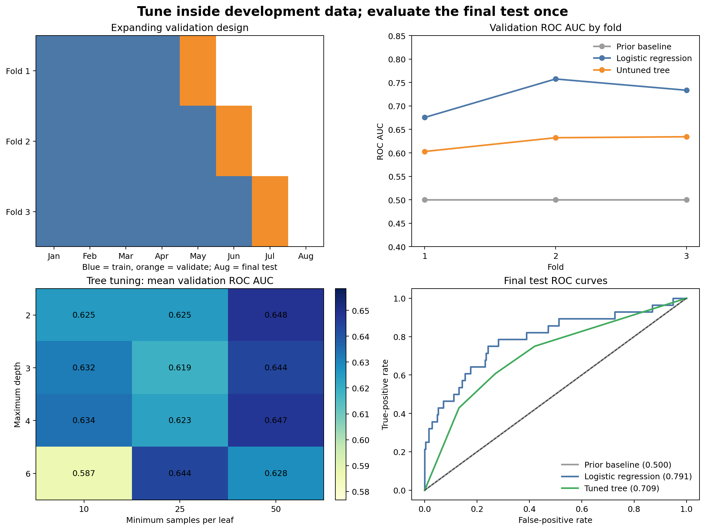

# Cross-Validation and Hyperparameter Tuning {#sec-cross-validation-tuning}

::: {.cdi-message}
- **ID:** MLPY-005
- **Type:** Model validation and hyperparameter-tuning chapter
- **Audience:** Learners comparing and tuning supervised models without contaminating final evaluation
- **Theme:** Estimate performance variability inside the development data and reserve the test set for one final assessment
:::

## Learning objectives

By the end of this chapter, you will be able to:

1. explain why a single validation split can produce an unstable model ranking;
2. choose cross-validation folds that respect rows, classes, groups, and time;
3. distinguish model parameters from hyperparameters;
4. tune a complete preprocessing-and-model pipeline with scikit-learn;
5. interpret mean validation performance together with fold-to-fold variability; and
6. evaluate the selected workflow once on an untouched final test set.

## Why one validation score is not enough

Chapter 04 established baselines and first models on a held-out period. That comparison is useful, but any single split can be unusually easy or difficult. A different validation month may contain a different class balance, customer mix, or operating environment.

Cross-validation repeats the train–validate process across several defensible folds. It provides a distribution of validation scores rather than one number.

::: callout-important
## Cross-validation does not repair a bad split design

The folds must reproduce the intended deployment boundary. Repeating a leakage-prone random split produces a more precise estimate of the wrong quantity.
:::

## Development data and final test data

Use two levels of evaluation:

- **Development data:** used for cross-validation, model comparison, feature decisions, and hyperparameter tuning.
- **Final test data:** isolated from all those decisions and used once after the workflow has been selected.

In this chapter, the first seven monthly snapshots form development data. The eighth month is the final test set. Cross-validation occurs only inside months one through seven.

## Choose folds from the generalization target

| Data structure | Suitable starting method | Main protection |
|---|---|---|
| Independent classification rows | `StratifiedKFold` | Class balance across folds |
| Repeated rows from the same entity | `GroupKFold` | Entity separation |
| Ordered observations | Expanding or rolling time folds | Future information stays out of training |
| Ordered observations from distinct entities | Grouped temporal design | Time and entity boundaries |

### Random and stratified folds

Standard K-fold cross-validation divides observations into $K$ parts, trains on $K-1$, and validates on the remaining part. Stratification approximately preserves the target proportion. Both assume that row exchangeability is compatible with deployment.

### Grouped folds

Grouped cross-validation keeps all records for one customer, patient, site, or device in the same fold. It is appropriate when evaluation should represent unseen entities.

### Expanding time folds

Expanding folds train on an increasing historical window and validate on the following period. For example:

| Fold | Training months | Validation month |
|---:|---|---|
| 1 | January–April | May |
| 2 | January–May | June |
| 3 | January–June | July |

August remains untouched as the final test month. This design mirrors monthly retraining with all available history.

## Build folds at the time-unit level

Scikit-learn's `TimeSeriesSplit` operates on ordered rows. When hundreds of customers share the same date, a row-based boundary can divide one month between training and validation. A safer approach is to define folds from complete time units.

```python
validation_months = sorted(development_data["snapshot_date"].unique())[-3:]

folds = []
for validation_month in validation_months:
    train_index = development_data.index[
        development_data["snapshot_date"] < validation_month
    ]
    validation_index = development_data.index[
        development_data["snapshot_date"] == validation_month
    ]
    folds.append((train_index, validation_index))
```

The complete script resets the development-data index so these labels also serve as the positional indices expected by scikit-learn.

## A reproducible validation and tuning workbench

Run the workflow from the repository root:

```bash
bash scripts/bash/05-run-cross-validation-and-tuning.sh
```

The workflow writes:

```text
data/processed/05-customer-validation-table.csv
results/figures/05-cross-validation-and-tuning.png
results/tables/05-validation-folds.csv
results/tables/05-cross-validation-results.csv
results/tables/05-tuning-results.csv
results/tables/05-final-test-results.csv
```

{#fig-cross-validation-tuning fig-alt="Four panels show expanding monthly folds, ROC AUC across three validation folds, decision-tree tuning scores by depth and leaf size, and final test ROC curves for the baseline, logistic model, and tuned tree." width=100%}

@fig-cross-validation-tuning separates two questions. Cross-validation estimates how consistently each candidate performs during development. The final panel measures the selected workflows once on the later untouched month.

## Parameters and hyperparameters

A **parameter** is learned during fitting. Logistic-regression coefficients and decision-tree split thresholds are parameters.

A **hyperparameter** controls how learning occurs and is chosen outside ordinary fitting. Examples include:

- regularization strength `C` in logistic regression;
- maximum tree depth;
- minimum observations per leaf; and
- number of trees in an ensemble.

Hyperparameters must be selected using validation data, not the final test set.

## Cross-validate the entire pipeline

Preprocessing must be refitted inside every fold. Pass the complete pipeline—not preprocessed arrays—to the validation function.

```python
from sklearn.model_selection import cross_validate

scores = cross_validate(
    workflow,
    X_development,
    y_development,
    cv=folds,
    scoring={
        "roc_auc": "roc_auc",
        "balanced_accuracy": "balanced_accuracy",
    },
    return_train_score=False,
)
```

For each fold, scikit-learn fits imputation, scaling, encoding, and the estimator using only that fold's training rows.

## Report variability, not only the mean

Summarize validation results with individual fold scores, their mean, and their standard deviation.

```python
mean_auc = scores["test_roc_auc"].mean()
standard_deviation = scores["test_roc_auc"].std(ddof=1)
```

A slightly higher mean with much greater variability may be less attractive than a stable alternative. With only a few folds, the standard deviation is descriptive rather than a precise uncertainty interval.

## Tune within cross-validation

The workbench tunes a shallow decision tree over a deliberately small grid:

```python
parameter_grid = {
    "decisiontreeclassifier__max_depth": [2, 3, 4, 6],
    "decisiontreeclassifier__min_samples_leaf": [10, 25, 50],
}
```

The full pipeline is passed to `GridSearchCV`:

```python
from sklearn.model_selection import GridSearchCV

search = GridSearchCV(
    estimator=tree_pipeline,
    param_grid=parameter_grid,
    scoring="roc_auc",
    cv=folds,
    refit=True,
    n_jobs=-1,
)

search.fit(X_development, y_development)
```

`refit=True` trains the winning configuration on all development rows after the fold comparisons. The final test set remains absent from the search.

## Grid search and randomized search

Grid search evaluates every supplied combination. It is appropriate for a small, intentional search space. Randomized search samples a fixed number of combinations from distributions and is often more efficient when many hyperparameters or broad numeric ranges are involved.

Neither method makes an excessively large search automatically rigorous. Trying many configurations increases the chance of adapting to validation noise. Keep the search space justified and compare the tuned result with simple references.

## Use multiple metrics thoughtfully

`GridSearchCV` can calculate several metrics, but one metric must define selection. Choose it from the decision problem before running the search.

This chapter selects by ROC AUC because the model will rank customers for review. Balanced accuracy remains a diagnostic of hard classifications at the default threshold. Later threshold selection should use operational costs and validation predictions.

## Perform the final evaluation once

After model and hyperparameter selection:

1. refit the selected workflow on all development data;
2. predict probabilities for the untouched test month;
3. calculate the pre-specified metrics;
4. compare with the baseline and untuned reference; and
5. document the complete evaluation design.

A lower final score than the cross-validation mean is not automatically a failure. It may reflect sampling variability, time drift, or validation overfitting. Report the difference and investigate it without retuning against the test month.

## Avoid common tuning errors

### Tuning on the final test set

Choosing hyperparameters after inspecting test performance converts the test set into validation data.

### Preprocessing once before cross-validation

This lets every validation fold influence imputation, scaling, encoding, or feature selection.

### Using ordinary random folds for temporal deployment

Future records can inform earlier validation predictions and inflate performance.

### Selecting the best fold

The most favorable fold is not the model's expected performance. Report all fold scores and the defined aggregate.

### Searching without a baseline

A heavily tuned workflow should still be compared with the dummy and simple-model references.

### Overinterpreting tiny differences

When score differences are small relative to fold variability, operational simplicity, speed, calibration, and maintainability may be better selection criteria.

## When nested cross-validation is needed

If the goal is an unbiased comparison of tuning procedures and no independent test set is available, nested cross-validation separates:

- an inner loop for hyperparameter selection; and
- an outer loop for estimating the tuned procedure's performance.

Nested cross-validation is computationally heavier. In this chapter, the later untouched month supplies the outer evaluation boundary, so tuning remains entirely within development data.

## Validation and tuning checklist

- [ ] The final test set is isolated before model comparison begins.
- [ ] Fold boundaries match the intended deployment scenario.
- [ ] All observations from one time unit stay together when required.
- [ ] Preprocessing and estimation are contained in one pipeline.
- [ ] The selection metric is declared before the search.
- [ ] The search space is small enough to justify or is sampled deliberately.
- [ ] Fold-level scores, means, and variability are saved.
- [ ] The selected workflow is refitted on all development data.
- [ ] Final test evaluation occurs once and is reported separately.

## Key takeaways

- Cross-validation estimates performance across several defensible training–validation boundaries.
- Fold design must preserve the same group or temporal structure expected in deployment.
- Pipelines prevent preprocessing from leaking across folds.
- Hyperparameters are selected inside development data, never from the final test result.
- Mean validation performance should be interpreted with fold-to-fold variability.
- A small, justified search is usually more informative than indiscriminate tuning.
- The untouched test set evaluates the complete selected procedure once.

## Looking ahead

Cross-validation and tuning identify promising workflows, but aggregate scores do not explain how a model fails. The next chapter develops classification and regression evaluation in depth, including confusion matrices, threshold-dependent metrics, probability calibration, residual diagnostics, and subgroup performance.
