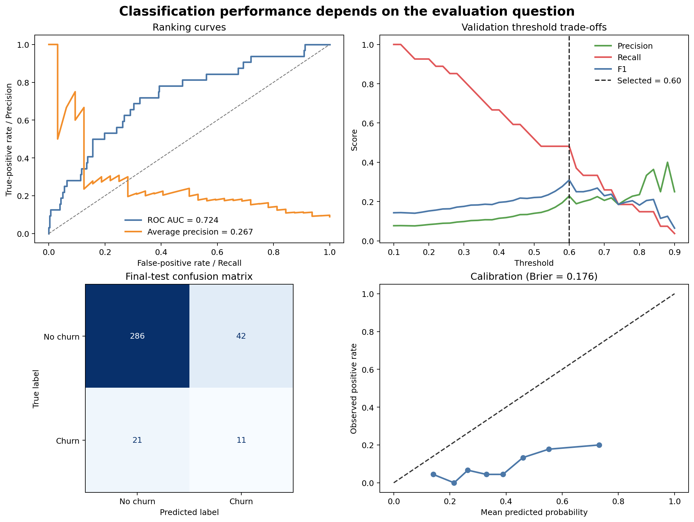
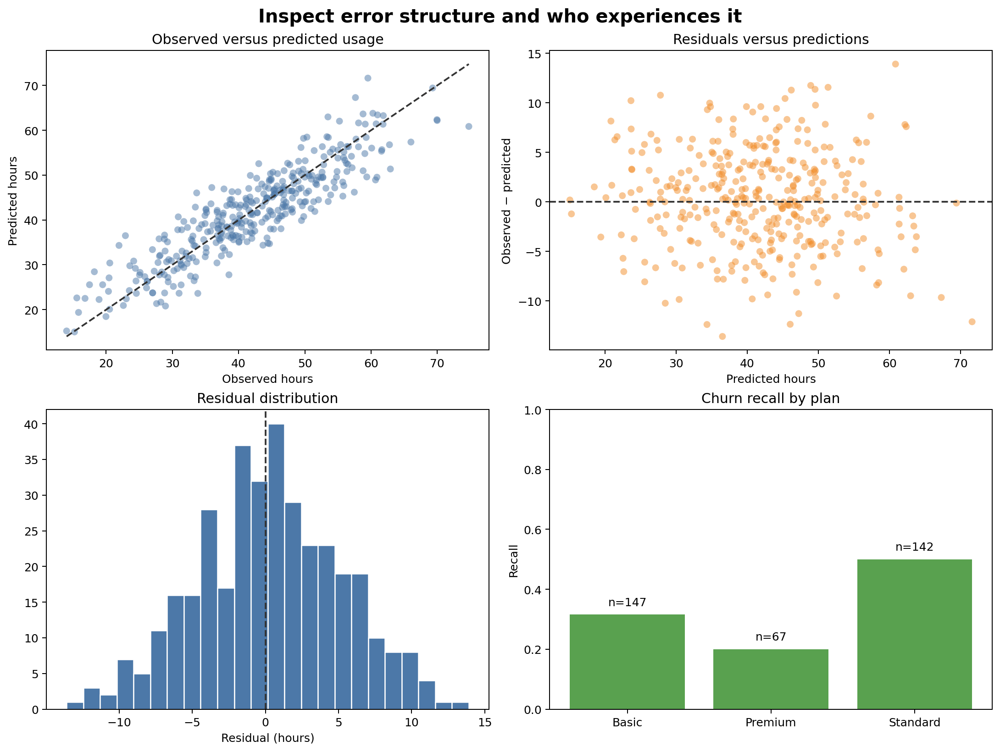

# Model Evaluation and Diagnostic Analysis {#sec-model-evaluation-diagnostics}

::: {.cdi-message}
- **ID:** MLPY-006
- **Type:** Predictive-performance evaluation and diagnostic-analysis chapter
- **Audience:** Learners assessing classification and regression workflows beyond a single aggregate score
- **Theme:** Connect model performance to decisions, error patterns, probability quality, and affected groups
:::

## Learning objectives

By the end of this chapter, you will be able to:

1. evaluate classification ranking, hard decisions, and predicted probabilities separately;
2. select a classification threshold using validation data rather than the final test set;
3. interpret confusion matrices, ROC curves, precision–recall curves, calibration, and Brier score;
4. diagnose regression performance with residuals and target-scale error metrics;
5. compare performance across meaningful subgroups while accounting for sample size; and
6. produce an auditable evaluation report from row-level predictions.

## Evaluation answers several questions

No single metric establishes that a model is good. A professional evaluation asks distinct questions:

- **Discrimination:** Does the model rank higher-risk observations above lower-risk observations?
- **Decision quality:** At a chosen threshold, which cases are correctly and incorrectly classified?
- **Probability quality:** Do predicted probabilities correspond to observed frequencies?
- **Error magnitude:** For regression, how large are prediction errors in practical units?
- **Error structure:** Do residuals change with the target, time, or feature values?
- **Subgroup performance:** Are errors concentrated in particular populations?
- **Operational value:** Are the errors acceptable for the intended action?

::: callout-important
## Separate ranking, probability, and decision evaluation

A classifier can rank cases well, produce poorly calibrated probabilities, and make poor hard decisions at the default threshold—all at the same time. Evaluate these properties separately.
:::

## Preserve three evaluation roles

The workbench uses chronological partitions:

- early months for model fitting;
- the penultimate month for threshold selection; and
- the final month for test evaluation.

After selecting the threshold from validation predictions, the model is refitted on all development months. The threshold remains fixed and is applied once to the final test probabilities.

This separation prevents the test outcomes from determining the operating rule.

## Classification evaluation

### Confusion matrix

For a binary target, hard predictions produce four counts:

| Outcome | Meaning |
|---|---|
| True positive | Positive case correctly identified |
| False positive | Negative case incorrectly flagged |
| True negative | Negative case correctly dismissed |
| False negative | Positive case missed |

From these counts:

$$
\text{Precision} = \frac{TP}{TP + FP}
$$

$$
\text{Recall} = \frac{TP}{TP + FN}
$$

$$
\text{Specificity} = \frac{TN}{TN + FP}
$$

The relative cost of false positives and false negatives determines which trade-off matters.

### ROC and precision–recall curves

The ROC curve plots true-positive rate against false-positive rate across thresholds. ROC AUC summarizes ranking performance.

The precision–recall curve focuses on positive predictions and is often more informative when the positive class is uncommon. Average precision summarizes this curve but should be interpreted relative to the positive-class prevalence.

### Probability calibration

A calibrated model assigns probabilities that agree with observed frequencies. Among cases assigned probability near 0.30, approximately 30% should be positive over repeated use.

The Brier score is the mean squared difference between predicted probability and binary outcome:

$$
\text{Brier score} = \frac{1}{n}\sum_{i=1}^{n}(p_i-y_i)^2
$$

Lower is better. Calibration depends on the deployment population and may change under prevalence or data drift.

## Select thresholds on validation data

The common threshold of 0.50 is not a universal optimum. Threshold choice converts predicted risk into an action and should reflect capacity and error costs.

The workbench evaluates candidate thresholds on validation data and selects the threshold that maximizes the F1 score:

```python
thresholds = np.arange(0.10, 0.91, 0.02)

for threshold in thresholds:
    prediction = (validation_probability >= threshold).astype(int)
    score = f1_score(validation_target, prediction)
```

F1 is used here for demonstration. In practice, select a criterion connected to the decision—for example, maximize recall subject to a workable precision or contact capacity.

## Regression evaluation

### Metrics in context

- **MAE** reports average absolute error in target units.
- **RMSE** gives more influence to large errors.
- **R²** compares squared error with the mean-prediction reference.

Always retain the target unit. An MAE of four means little until it is stated as four usage hours, four days, or four thousand shillings.

### Residual diagnostics

For observation $i$:

$$
e_i = y_i - \hat{y}_i
$$

A residual-versus-predicted plot can reveal:

- systematic underprediction or overprediction;
- changing error spread;
- nonlinear structure not captured by the model;
- influential extreme cases; and
- impossible predictions outside the target domain.

Residual patterns are diagnostic evidence, not a checklist that every predictive model must satisfy perfectly.

## A reproducible evaluation workbench

Run the complete workflow from the repository root:

```bash
bash scripts/bash/06-run-model-evaluation.sh
```

The workflow writes:

```text
data/processed/06-evaluation-data.csv
results/figures/06-classification-diagnostics.png
results/figures/06-regression-and-subgroup-diagnostics.png
results/tables/06-classification-metrics.csv
results/tables/06-threshold-analysis.csv
results/tables/06-regression-metrics.csv
results/tables/06-subgroup-performance.csv
results/tables/06-test-predictions.csv
```

{#fig-classification-diagnostics fig-alt="Four panels show ROC and precision-recall curves, validation precision recall and F1 across thresholds, a final-test confusion matrix, and observed event frequency versus predicted probability." width=100%}

{#fig-regression-diagnostics fig-alt="Four panels show observed versus predicted usage, residuals versus predictions, the residual distribution, and subgroup recall with sample-size labels across customer plans." width=100%}

@fig-classification-diagnostics evaluates the classifier as a ranker, probability estimator, and decision rule. @fig-regression-diagnostics checks target-scale errors and whether performance differs across groups.

## Build row-level prediction evidence

Aggregate metrics should be reproducible from saved row-level predictions. Preserve:

- stable row and entity identifiers;
- partition and prediction date;
- observed target;
- predicted probability or value;
- selected threshold and hard prediction;
- subgroup fields needed for approved evaluation; and
- model or workflow version.

Do not include sensitive attributes without a legitimate evaluation purpose and appropriate controls.

## Evaluate subgroups responsibly

Overall performance can conceal weak performance for a smaller group. For each meaningful subgroup, report:

- number of observations;
- number and rate of positive outcomes;
- relevant classification or regression metrics; and
- uncertainty or a warning when the sample is small.

```python
for group_name, group_data in predictions.groupby("plan", dropna=False):
    recall = recall_score(
        group_data["observed_churn"],
        group_data["predicted_churn"],
        zero_division=0,
    )
```

A difference is a signal for investigation, not proof of unfairness or causation. Check sample size, measurement quality, base rates, threshold effects, and the consequences of errors.

## Interpret metrics together

| Evidence pattern | Possible interpretation | Next question |
|---|---|---|
| Strong ROC AUC, weak precision | Ranking signal exists but positives are uncommon or threshold is unsuitable | What workload and precision are acceptable? |
| Strong ROC AUC, weak calibration | Ranking is useful but probabilities should not be treated as literal risk | Would calibration on representative validation data help? |
| Good MAE, patterned residuals | Average error is acceptable but systematic structure remains | Which segments or ranges are misestimated? |
| Good overall score, weak subgroup recall | Aggregate performance hides uneven errors | Are data, features, or thresholds inadequate for that group? |
| Cross-validation strong, final test weaker | Later data may differ or tuning adapted to validation history | Is there temporal drift or validation overfitting? |

## Avoid common evaluation errors

### Reporting accuracy alone

Accuracy can be high when the positive class is rarely predicted. Include class-sensitive metrics and the confusion matrix.

### Selecting a threshold on test data

This contaminates the final evaluation. Choose thresholds on validation predictions and keep them fixed.

### Treating ROC AUC as operational performance

ROC AUC averages ranking behavior across thresholds, including thresholds that may never be used.

### Ignoring probability calibration

Risk estimates used for planning, prioritization, or expected-value calculations need probability evaluation.

### Inspecting only average regression error

Two models can share the same MAE while one has serious errors concentrated in a critical range or group.

### Publishing subgroup metrics from tiny samples

Unstable estimates can mislead or expose individuals. Apply minimum sample rules and communicate uncertainty.

## Evaluation checklist

- [ ] Metrics correspond to the intended use of predictions.
- [ ] Threshold selection uses validation data only.
- [ ] The final test set remains untouched until evaluation.
- [ ] Ranking, calibration, and hard decisions are evaluated separately.
- [ ] Regression errors are reported in target units.
- [ ] Residual plots are inspected for systematic structure.
- [ ] Row-level predictions reproduce every reported metric.
- [ ] Relevant subgroups are checked with sample sizes shown.
- [ ] Limitations and operational consequences accompany the scores.

## Key takeaways

- Model evaluation is a collection of decision-relevant questions, not one score.
- Classification ranking, probability quality, and thresholded decisions require different evidence.
- Thresholds belong to validation and operational design—not final test optimization.
- Regression metrics should be supported by residual diagnostics.
- Subgroup evaluation can reveal concentrated errors hidden by aggregate results.
- Saved row-level predictions make metrics, plots, and error analysis auditable.
- Evaluation findings should determine whether to improve, restrict, calibrate, or reject a model.

## Looking ahead

Evaluation shows where a model succeeds and fails; interpretation investigates what drives its predictions. The next chapter develops model interpretation with coefficients, permutation importance, partial dependence, and case-level explanations while distinguishing predictive association from causation.
