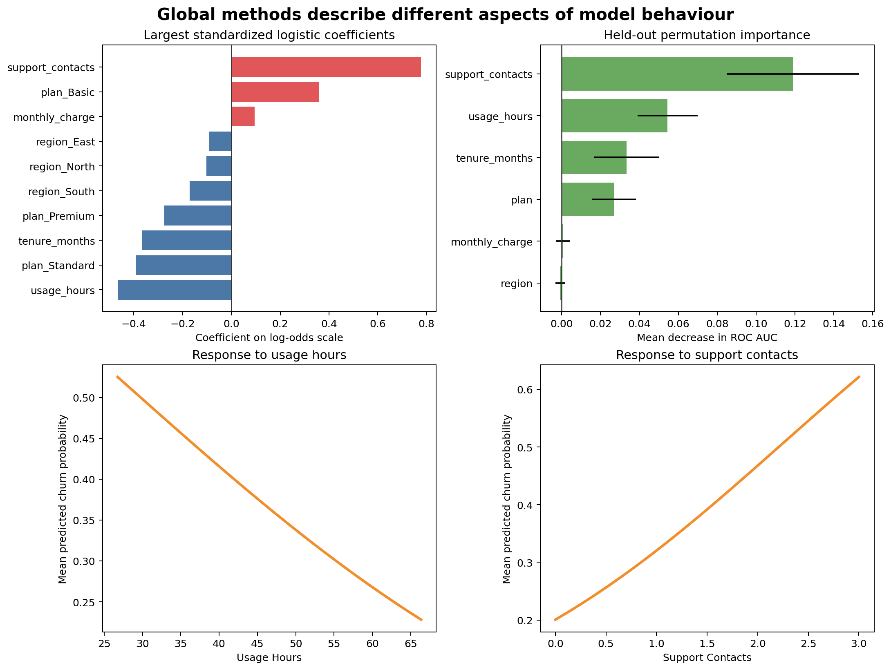
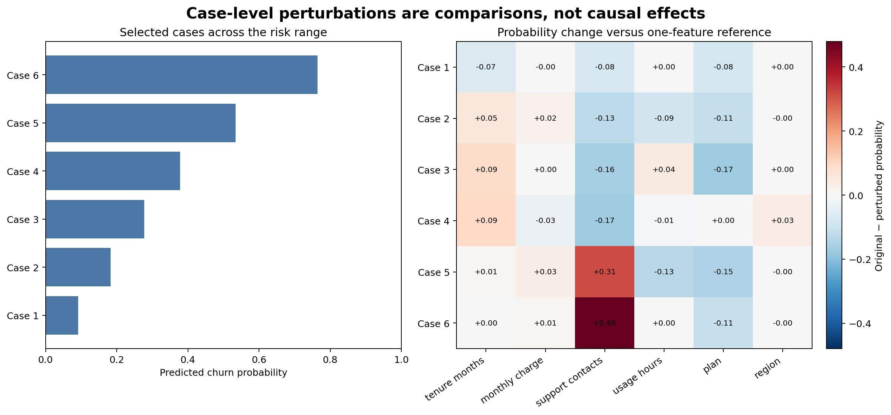

# Model Interpretation and Explainability {#sec-model-interpretation}

::: {.cdi-message}
- **ID:** MLPY-007
- **Type:** Global and case-level model-interpretation chapter
- **Audience:** Learners investigating model behaviour after establishing predictive validity
- **Theme:** Explain what a fitted model uses, how predictions respond, and where interpretation stops
:::

## Learning objectives

By the end of this chapter, you will be able to:

1. distinguish global interpretation from case-level explanation;
2. interpret standardized linear-model coefficients cautiously;
3. calculate held-out permutation importance for a complete pipeline;
4. construct model-response curves for numeric features;
5. create transparent case perturbations for selected predictions;
6. recognize instability caused by correlated or unsupported feature combinations; and
7. separate predictive association from causal effect.

## Interpretation begins after validation

Interpretation cannot rescue a model that has not been evaluated properly. First confirm that the data, split, metrics, and error profile are suitable for the intended use. Then ask what the fitted workflow appears to have learned.

Interpretation serves several purposes:

- checking whether model behaviour is plausible;
- identifying features associated with predictions;
- diagnosing shortcuts and leakage;
- communicating how predictions vary;
- investigating individual decisions; and
- deciding whether the model requires restriction or further review.

::: callout-important
## Explanation is not validation

A convincing explanation does not show that a prediction is accurate, fair, stable, or useful. Evaluation and interpretation provide different evidence.
:::

## Global and case-level questions

| Scope | Question | Example method |
|---|---|---|
| Global | Which features matter across the evaluation population? | Permutation importance |
| Global | In which direction is a linear association? | Standardized coefficient |
| Global | How does average prediction respond as one feature varies? | Model-response curve |
| Case-level | Why is this case scored differently from a reference version? | Feature perturbation |
| Case-level | Which inputs most affect one prediction? | Local attribution method |

Global importance should not be used as an explanation for every individual case. A feature can matter greatly overall while having little effect on one particular prediction.

## Interpreting logistic-regression coefficients

For logistic regression:

$$
\log\left(\frac{p}{1-p}\right)=\beta_0+\beta_1x_1+\cdots+\beta_px_p
$$

A positive coefficient increases predicted log-odds when other encoded features are held constant; a negative coefficient decreases them. Exponentiating a coefficient gives an odds ratio for a one-unit increase in its transformed feature.

The workbench standardizes numeric features, so their coefficient magnitudes refer to one training standard deviation. One-hot categorical coefficients are relative to the model's encoded representation and should be interpreted with the full encoding scheme in mind.

```python
feature_names = pipeline.named_steps["columntransformer"].get_feature_names_out()
coefficients = pipeline.named_steps["logisticregression"].coef_[0]
```

Coefficient magnitude can become unstable when predictors are correlated. Predictive performance may remain stable even while individual coefficients change substantially.

## Permutation importance

Permutation importance measures how much a fitted model's score deteriorates when one feature is randomly shuffled.

```python
from sklearn.inspection import permutation_importance

importance = permutation_importance(
    pipeline,
    X_test,
    y_test,
    scoring="roc_auc",
    n_repeats=20,
    random_state=42,
)
```

Because the complete pipeline receives the original dataframe, the reported importances correspond to the original input columns rather than individual one-hot columns.

Interpretation requires care:

- correlated features can substitute for one another, reducing measured importance;
- importance depends on the evaluation sample and metric;
- shuffling can create unrealistic feature combinations; and
- negative importance can occur through sampling variation or harmful model reliance.

Use held-out data when the question is which features support generalization. Training-set importance can describe fitted behaviour but may reward overfitting.

## Model-response curves

A partial-dependence-style response curve replaces one feature with a sequence of values, predicts every row, and averages the probabilities:

```python
for value in grid:
    modified = evaluation_data.copy()
    modified[feature] = value
    mean_probability = pipeline.predict_proba(modified)[:, 1].mean()
```

The curve describes the model, not necessarily the data-generating process. When a feature is correlated with others, replacement can produce combinations that rarely or never occur naturally.

The chapter workflow creates response curves only within the central observed range to reduce unsupported extrapolation.

## Case-level perturbations

For selected test cases, the workbench replaces one feature at a time with a development-data reference value:

- numeric feature → development median;
- categorical feature → development mode.

It records:

$$
\Delta p = p(\text{original case}) - p(\text{case with one reference value})
$$

A positive difference means the observed feature value raises predicted risk relative to that reference perturbation. These differences are not additive contributions and should not be summed.

## A reproducible interpretation workbench

Run the workflow from the repository root:

```bash
bash scripts/bash/07-run-model-interpretation.sh
```

The workflow writes:

```text
data/processed/07-interpretation-data.csv
results/figures/07-global-model-interpretation.png
results/figures/07-case-level-interpretation.png
results/tables/07-logistic-coefficients.csv
results/tables/07-permutation-importance.csv
results/tables/07-model-response-curves.csv
results/tables/07-case-perturbations.csv
results/tables/07-selected-cases.csv
```

{#fig-global-interpretation fig-alt="Four panels show the largest positive and negative standardized logistic coefficients, permutation importance measured by ROC AUC decrease, and average predicted churn response curves for usage hours and support contacts." width=100%}

{#fig-case-interpretation fig-alt="Two panels show predicted churn risk for six selected customer cases and a heatmap of probability changes after one feature at a time is replaced with its development median or mode." width=100%}

@fig-global-interpretation combines methods that answer different questions. Coefficients describe a linear model's transformed scale, permutation importance measures held-out score dependence, and response curves show average model behaviour. @fig-case-interpretation narrows the scope to selected predictions.

## Interpret an entire pipeline

Production predictions come from preprocessing and estimation together. Interpretation code must therefore retain:

- learned missing-value replacements;
- scaling statistics;
- category vocabularies;
- feature ordering; and
- the fitted estimator.

Extracting an estimator and applying it to raw columns produces invalid explanations. Save and interpret the fitted pipeline as one workflow.

## Stability matters

An explanation is more trustworthy when it is reasonably stable across:

- validation folds;
- time periods;
- plausible model specifications;
- repeated permutation seeds; and
- representative population subgroups.

The permutation table includes a standard deviation across repeated shuffles. Large variation warns that the importance estimate is uncertain. For high-stakes use, repeat interpretation across resamples rather than publishing one fitted explanation.

## Association is not causation

Predictive interpretation describes relationships learned from observed data. It does not establish that changing a feature will cause the prediction target to change.

For example, high support-contact counts may raise predicted churn risk because they reflect unresolved problems. Forcing the count downward in a dataset would not necessarily prevent churn. It may only hide evidence of dissatisfaction.

Causal claims require a causal question, explicit assumptions, appropriate design, and methods that address confounding and intervention.

## Explanation risks

### Leakage can look important

A post-outcome feature may dominate every importance method. That is a warning to audit timing, not evidence of a valuable predictor.

### Correlated features divide credit

Two measures of similar information may each appear modest because either can replace the other.

### Unsupported perturbations mislead

Changing one feature while holding everything else fixed may create impossible cases. Inspect joint distributions and domain constraints.

### Local explanations can be overgeneralized

An explanation for one customer does not describe the model globally or another customer's prediction.

### Explanation can expose sensitive information

Case-level artifacts should follow the same access, privacy, and retention controls as predictions and source data.

## Interpretation checklist

- [ ] Predictive validity is established before interpretation.
- [ ] The interpretation question is explicitly global or case-level.
- [ ] The complete fitted pipeline is interpreted.
- [ ] Importance is calculated on representative held-out data.
- [ ] Repeated estimates or stability checks accompany rankings.
- [ ] Response grids remain within supported data ranges.
- [ ] Local perturbations are labelled as comparisons, not additive causes.
- [ ] Correlation and feature dependence are discussed.
- [ ] Predictive associations are not presented as causal effects.
- [ ] Sensitive explanation artifacts receive appropriate controls.

## Key takeaways

- Interpretation methods answer different global and case-level questions.
- Standardized coefficients show direction and linear-model association on the transformed scale.
- Permutation importance measures dependence of held-out performance on original inputs.
- Model-response curves describe predictions under controlled feature replacement, not interventions.
- Case perturbations compare a prediction with transparent reference versions of the same row.
- Correlation, unsupported combinations, sampling variability, and leakage can distort explanations.
- Predictive explanation never establishes causation by itself.

## Looking ahead

Interpretation reveals how a fitted model behaves, but reliable systems also need reproducible training artifacts. The next chapter develops model persistence, metadata, reproducible prediction, and safe artifact loading as the bridge from modelling to deployment.
