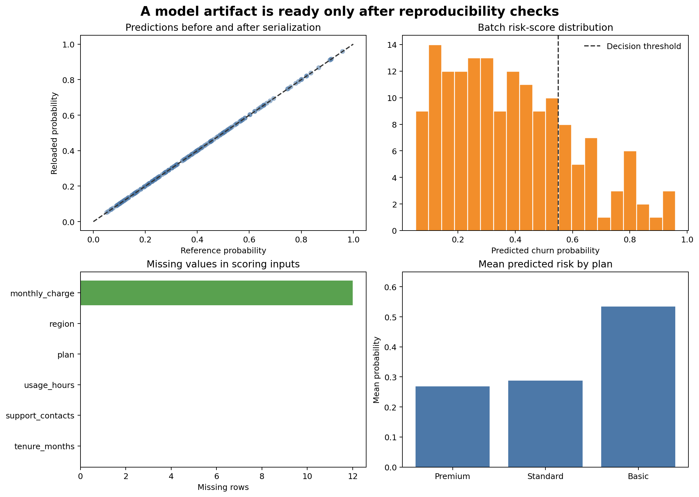

# Model Persistence and Reproducible Prediction {#sec-model-persistence}

::: {.cdi-message}
- **ID:** MLPY-008
- **Type:** Model artifact and reproducible-inference chapter
- **Audience:** Learners preparing validated scikit-learn workflows for reliable reuse
- **Theme:** Persist the complete prediction contract, verify reproducibility, and treat model files as governed software artifacts
:::

## Learning objectives

By the end of this chapter, you will be able to:

1. persist a complete preprocessing-and-model pipeline;
2. define and validate an input feature schema;
3. record model metadata, package versions, metrics, and file integrity information;
4. load an approved artifact and generate batch predictions reproducibly;
5. verify prediction equivalence before and after serialization; and
6. explain the security and compatibility limitations of Python model files.

## A model is more than fitted coefficients

A reusable prediction workflow includes every learned transformation required to convert raw inputs into predictions:

- required input columns and their meanings;
- missing-value handling;
- numeric scaling;
- categorical encoding;
- feature ordering;
- the fitted estimator;
- class-label ordering;
- the selected decision threshold; and
- compatible software versions.

Saving only the final estimator breaks this contract. The estimator expects the transformed matrix created during training, not the raw table used by future callers.

::: callout-important
## Persist the complete pipeline

The safest basic scikit-learn pattern is to fit preprocessing and estimation in one pipeline, save that fitted pipeline, and pass future raw feature tables through the same object.
:::

## The artifact bundle

This chapter creates a small governed bundle:

```text
artifacts/
├── 08-churn-pipeline.joblib
├── 08-feature-schema.json
└── 08-model-metadata.json
```

The binary file contains the fitted pipeline. The JSON files remain human-readable and support review before any binary deserialization occurs.

### Feature schema

The schema records:

- required feature names;
- expected logical types;
- whether missing values are permitted;
- allowed categories where appropriate; and
- target and prediction definitions.

### Model metadata

Metadata records:

- artifact identifier and version;
- creation timestamp;
- estimator and preprocessing classes;
- training and evaluation periods;
- selected threshold;
- evaluation metrics;
- Python and package versions;
- training row counts; and
- SHA-256 checksum of the binary artifact.

Metadata describes an artifact; it does not make an untrusted artifact safe to load.

## Build and verify the artifact

Run the complete workflow from the repository root:

```bash
bash scripts/bash/08-build-and-verify-model-artifact.sh
```

The Bash workflow runs two separate programs:

1. `08-build-model-artifact.py` generates training and scoring data, fits the pipeline, saves the artifact bundle, and stores reference probabilities.
2. `08-run-batch-prediction.py` validates incoming columns, verifies the checksum, reloads the pipeline, creates predictions, and checks them against the reference probabilities.

The workflow writes:

```text
data/processed/08-training-data.csv
data/scoring/08-scoring-batch.csv
artifacts/08-churn-pipeline.joblib
artifacts/08-feature-schema.json
artifacts/08-model-metadata.json
results/figures/08-model-artifact-verification.png
results/tables/08-reference-probabilities.csv
results/tables/08-batch-predictions.csv
results/tables/08-artifact-verification.csv
```

{#fig-model-artifact-verification fig-alt="Four panels show original versus reloaded probabilities on the identity line, the distribution of batch risk scores, missing-value counts by input feature, and mean predicted churn probability by plan." width=100%}

@fig-model-artifact-verification provides visible evidence that serialization did not alter predictions and that the scoring batch has the expected structure.

## Save a pipeline with joblib

```python
from joblib import dump

pipeline.fit(X_train, y_train)
dump(pipeline, "artifacts/08-churn-pipeline.joblib")
```

`joblib` is convenient for scikit-learn objects containing NumPy arrays. It is available as a scikit-learn dependency in the guide environment.

The output should be written only after training and evaluation checks pass. An artifact promoted for use should be immutable: create a new version instead of silently overwriting the approved file.

## Validate the input contract before prediction

Future data can be syntactically valid CSV while violating the model contract. Check required columns before loading or scoring:

```python
required = schema["required_features"]
missing = sorted(set(required) - set(scoring_data.columns))
unexpected = sorted(set(scoring_data.columns) - set(required + schema["identifier_fields"]))

if missing:
    raise ValueError(f"Missing required features: {missing}")
```

Also validate:

- numeric conversion and finite values;
- allowed categories and treatment of unknown levels;
- plausible ranges;
- identifier uniqueness where required;
- missingness policy; and
- row count and source-date expectations.

`OneHotEncoder(handle_unknown="ignore")` prevents a runtime exception for unseen categories, but an unknown category should still be counted and monitored.

## Verify file integrity

A checksum detects accidental or unauthorized byte changes:

```python
from hashlib import sha256

digest = sha256(artifact_path.read_bytes()).hexdigest()

if digest != metadata["artifact_sha256"]:
    raise ValueError("Artifact checksum does not match metadata")
```

A matching checksum proves only that the file matches the recorded bytes. Trust still depends on how the metadata was created, stored, and approved.

## Load only trusted artifacts

```python
from joblib import load

pipeline = load("artifacts/08-churn-pipeline.joblib")
```

::: callout-warning
## Python model files can execute code during loading

`joblib` and pickle-based formats must never be loaded from unknown, unverified, or user-supplied sources. Restrict artifact write access, verify provenance and integrity before loading, and load only artifacts produced by a trusted workflow.
:::

For stronger isolation or cross-language serving, alternative formats and restricted serving architectures may be appropriate. Format selection depends on supported operators, portability, performance, and threat model.

## Create reproducible predictions

The batch prediction script preserves identifiers and adds versioned outputs:

```python
probability = pipeline.predict_proba(scoring_data[required_features])[:, 1]
prediction = (probability >= metadata["decision_threshold"]).astype(int)

output = scoring_data[["customer_id", "prediction_date"]].copy()
output["churn_probability"] = probability
output["predicted_churn"] = prediction
output["model_version"] = metadata["model_version"]
```

Production outputs should also record a scoring timestamp, source batch identifier, and artifact checksum or immutable artifact reference.

## Test serialization equivalence

Before saving, the training script stores predictions for a small fixed scoring batch. The separate batch script loads the artifact and recomputes them.

```python
maximum_difference = np.max(
    np.abs(reference_probability - reloaded_probability)
)

assert maximum_difference < 1e-12
```

This is a regression test for artifact round-tripping. It does not prove that a new package version will reproduce the same outputs, so the metadata also records the training environment.

## Version compatibility

Pickle-based scikit-learn artifacts are not a durable cross-version interchange format. The most reliable practice is to:

- pin package versions used for training;
- record versions in metadata;
- rebuild and validate artifacts when dependencies change;
- test loading and prediction in the target environment; and
- retain the training code and reproducible data reference.

Do not solve a compatibility warning by suppressing it without validation.

## Separate code, data, and artifacts

```text
scripts/python/   # training and prediction programs
data/             # reproducible training and scoring inputs
artifacts/        # fitted immutable model bundle
results/          # predictions, verification, and figures
```

The repository may exclude large or sensitive production artifacts from Git while tracking metadata or an artifact manifest. Storage, access controls, and retention should match the sensitivity of the training data and predictions.

## Release checks

Before approving an artifact, verify:

- [ ] The final pipeline contains preprocessing and estimation.
- [ ] Training and evaluation data boundaries are documented.
- [ ] Evaluation metrics meet the defined acceptance criteria.
- [ ] Required columns and logical types are recorded in a schema.
- [ ] The decision threshold and class ordering are explicit.
- [ ] Package versions and creation time are recorded.
- [ ] The artifact checksum matches the metadata.
- [ ] Reloaded predictions match reference predictions.
- [ ] Batch outputs contain model-version traceability.
- [ ] Loading is restricted to trusted artifacts.

## Key takeaways

- A deployable model artifact must preserve preprocessing and estimation together.
- Schema and metadata files make the prediction contract reviewable.
- Checksums detect byte changes but do not replace trusted provenance.
- Pickle-based artifacts must never be loaded from untrusted sources.
- Reference predictions test that serialization and loading preserve behaviour.
- Package versions, thresholds, metrics, and data periods belong in artifact metadata.
- Reproducible inference requires validated inputs and traceable outputs, not merely a saved model file.

## Looking ahead

A verified artifact is ready to be integrated into a repeatable prediction workflow. The next chapter develops batch prediction, input and output validation, failure handling, logging, and monitoring-ready records without turning this guide into a deployment manual.
