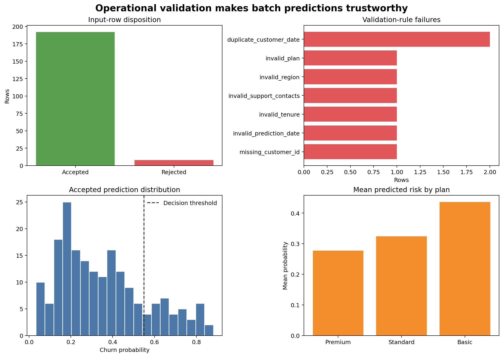

# Batch Prediction and Operational Validation {#sec-batch-prediction}

::: {.cdi-message}
- **ID:** MLPY-009
- **Type:** Batch-scoring reliability and operational-validation chapter
- **Audience:** Learners converting a verified model artifact into a repeatable prediction workflow
- **Theme:** Validate every batch, isolate bad records, create traceable outputs, and fail visibly when contracts are broken
:::

## Learning objectives

By the end of this chapter, you will be able to:

1. define the stages of a reliable batch prediction workflow;
2. validate batch-level and row-level input requirements;
3. quarantine invalid records without silently changing them;
4. generate stable prediction and run identifiers;
5. write traceable predictions, structured logs, and run manifests;
6. distinguish warnings from errors that should stop scoring; and
7. create monitoring-ready summaries for later drift and performance analysis.

## Prediction is a data-processing job

Once a model artifact has been verified, prediction is not merely a call to `predict_proba`. A dependable batch job must control the complete movement from source rows to reviewed outputs.

```text
receive → identify → validate → quarantine → score → verify → publish → record
```

Each stage should leave evidence. If a result is questioned later, the team should be able to identify the input batch, artifact version, validation rules, rejected rows, prediction time, and output file.

::: callout-important
## Never silently repair scoring data

Model preprocessing may handle expected missing values. Operational validation handles broken contracts. A missing optional measurement can be imputed; an absent required column, duplicate business key, impossible value, or invalid date should be reported explicitly.
:::

## The batch contract

A scoring contract covers more than column names.

### Batch-level requirements

- source batch identifier is present and unique;
- expected columns exist;
- file can be parsed with the declared encoding and delimiter;
- row count is within a plausible range;
- the prediction date is the expected period; and
- no earlier successful run used the same batch and model version.

### Row-level requirements

- business identifiers are present;
- identifiers are unique within the prediction period;
- numeric values can be parsed and fall within approved ranges;
- categorical values are allowed or follow a documented unknown-category policy;
- missingness is permitted only for designated fields; and
- timestamps do not occur after the prediction cutoff.

## Errors, quarantines, and warnings

| Severity | Example | Action |
|---|---|---|
| Fatal batch error | Required feature column missing | Stop the run; publish no predictions |
| Row rejection | Missing customer ID or impossible negative tenure | Quarantine the row; score valid rows only if policy allows |
| Warning | Unknown category handled by the encoder | Score, count, and flag for review |
| Information | Expected missing monthly charge | Score through approved imputation; record the count |

The acceptable rejected-row rate must be defined before production use. If rejection exceeds that limit, the safest policy may be to fail the entire batch.

## A reproducible batch-scoring workbench

Run the workflow from the repository root:

```bash
bash scripts/bash/09-run-batch-prediction-workflow.sh
```

The workflow creates a fitted demonstration pipeline, generates a scoring batch containing valid and deliberately invalid records, applies the operational checks, quarantines rejected rows, and scores the accepted rows.

It writes:

```text
data/processed/09-training-data.csv
data/scoring/09-input-batch.csv
data/quarantine/09-rejected-rows.csv
results/figures/09-batch-prediction-operations.png
results/tables/09-batch-predictions.csv
results/tables/09-row-validation.csv
results/tables/09-run-summary.csv
results/manifests/09-run-manifest.json
results/logs/09-batch-scoring.jsonl
```

{#fig-batch-prediction-operations fig-alt="Four panels show accepted and rejected row counts, validation-rule failure counts, accepted prediction probability distribution with the decision threshold, and mean predicted churn probability by plan." width=100%}

@fig-batch-prediction-operations summarizes whether the run was operationally healthy before anyone acts on its predictions.

## Generate stable identifiers

### Batch identifier

A batch ID should identify the logical source batch. It may combine source system, prediction period, and a source-file checksum.

### Run identifier

A run ID identifies one execution. It links logs, manifest, validation results, and predictions.

### Prediction identifier

A deterministic prediction ID supports safe retries:

```python
prediction_key = "|".join(
    [customer_id, prediction_date, model_version]
)
prediction_id = hashlib.sha256(prediction_key.encode("utf-8")).hexdigest()
```

Running the same approved model for the same customer and prediction date produces the same ID. Downstream systems can use it to avoid duplicate actions.

## Make retries idempotent

An idempotent job can be retried without creating duplicate business effects. Achieving this requires more than deterministic predictions:

- use a stable source-batch ID;
- generate deterministic prediction IDs;
- write to a temporary or versioned destination first;
- validate output completeness;
- publish through an atomic replace or controlled merge; and
- record the successful batch and model-version pair.

The chapter writes local demonstration files. A production scheduler or database should enforce the same rules transactionally.

## Validate rows without losing evidence

The workflow produces a row-validation table with one record per input row:

```python
validation["missing_customer_id"] = data["customer_id"].isna()
validation["invalid_tenure"] = data["tenure_months"].lt(0)
validation["invalid_plan"] = ~data["plan"].isin(allowed_plans)
```

The final acceptance flag is derived from named rules. Rejected rows are copied to quarantine with their failure reasons. The original input file remains unchanged.

Avoid a single vague `invalid` column. Named rules let operators identify whether a new source defect or a known exception caused the failure.

## Score only accepted rows

```python
accepted = input_data.loc[validation["accepted"]].copy()
probability = pipeline.predict_proba(accepted[required_features])[:, 1]
```

Predictions retain:

- prediction and run identifiers;
- source batch ID;
- customer and prediction date;
- probability and thresholded decision;
- model and schema versions;
- scoring timestamp; and
- warning flags.

This information turns a bare score into an auditable record.

## Verify output invariants

Before publishing predictions, assert that:

- output row count equals accepted input row count;
- every prediction ID is unique;
- probabilities are finite and lie between zero and one;
- hard predictions agree with the recorded threshold;
- required identifiers are non-missing; and
- every output row carries the expected model version.

```python
assert len(predictions) == accepted_rows
assert predictions["prediction_id"].is_unique
assert predictions["churn_probability"].between(0, 1).all()
```

A failed invariant should stop publication even if model inference completed.

## Structured logging

Human-readable console messages are useful during development, but operational logs should be machine-readable. The workbench writes JSON Lines events such as:

```json
{"event":"validation_completed","accepted_rows":192,"rejected_rows":8}
```

Useful event fields include:

- timestamp, run ID, and batch ID;
- event name and severity;
- model and schema versions;
- row counts and rule failures;
- duration by stage; and
- final run status.

Do not log raw sensitive features or full prediction records unless explicitly required and protected.

## Run manifest

The manifest is a compact record of the completed execution. It includes:

- source and output paths;
- input checksum;
- run, batch, model, and schema identifiers;
- start and completion times;
- total, accepted, rejected, and warning counts;
- threshold and prediction count;
- output checksum; and
- final status.

Logs describe events over time; the manifest summarizes the completed run.

## Monitoring-ready summaries

Before outcomes are available, every batch should capture:

- row counts and rejection rates;
- missingness and unknown-category counts;
- numeric feature summaries;
- predicted-probability distribution;
- predicted-positive rate; and
- group-level volumes and score summaries where appropriate.

These records establish the inputs for drift monitoring. They do not prove that predictive performance remains acceptable because true labels may arrive later.

## Failure-handling checklist

- [ ] Required columns are checked before model loading and scoring.
- [ ] Batch identity and previous processing status are checked.
- [ ] Row-level rules have named failure reasons.
- [ ] Rejected rows are preserved in quarantine.
- [ ] Rejection-rate limits determine whether partial scoring is allowed.
- [ ] Output invariants run before publication.
- [ ] Prediction IDs support idempotent retries.
- [ ] Logs avoid unnecessary sensitive information.
- [ ] The run manifest links input, artifact, and output evidence.
- [ ] Failed runs publish no ambiguous partial result.

## Key takeaways

- Batch prediction is a controlled data-processing workflow, not just model inference.
- Batch-level errors, row rejections, warnings, and expected missingness require different responses.
- Invalid rows should be quarantined with explicit reasons rather than silently repaired or discarded.
- Stable identifiers and atomic publication support safe retries.
- Output invariants can catch failures after inference but before predictions are used.
- Structured logs and manifests make runs traceable.
- Monitoring begins with high-quality batch records even before outcome labels arrive.

## Looking ahead

Operational records make model behaviour observable over time. The next chapter develops data drift, prediction drift, delayed performance monitoring, alert thresholds, and retraining decisions while avoiding automatic retraining from weak signals.
