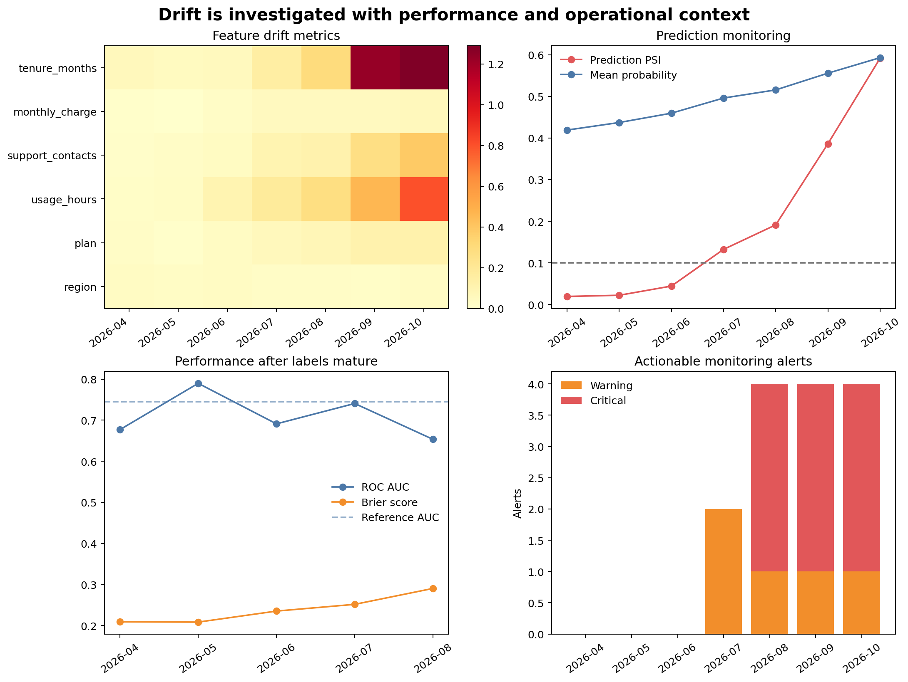

# Monitoring Drift and Model Performance {#sec-monitoring-drift}

::: {.cdi-message}
- **ID:** MLPY-010
- **Type:** Model monitoring and retraining-governance chapter
- **Audience:** Learners responsible for evaluating model behaviour after repeated scoring runs
- **Theme:** Detect meaningful change, connect drift with delayed outcomes, and investigate before retraining
:::

## Learning objectives

By the end of this chapter, you will be able to:

1. distinguish data, prediction, concept, and performance drift;
2. compare monitoring batches with a documented reference population;
3. calculate population stability index and categorical distribution distance;
4. monitor prediction distributions before labels arrive;
5. evaluate discrimination and probability error after delayed outcomes become available;
6. design warning and critical alerts that require investigation; and
7. make evidence-based retraining decisions.

## Models operate in changing systems

Evaluation at release time describes one historical population. After release, customer behaviour, collection systems, product policies, economic conditions, and operational processes can change. Monitoring asks whether the current prediction process still resembles the conditions under which the model was validated.

::: callout-important
## Drift is a signal, not a diagnosis

A changed feature distribution does not prove that model performance has declined. A stable distribution does not prove that performance remains acceptable. Drift alerts should trigger investigation and, when labels arrive, performance evaluation.
:::

## Four kinds of change

| Change | Meaning | Observable without outcomes? |
|---|---|---:|
| Data drift | Distribution of model inputs changes | Yes |
| Prediction drift | Distribution of scores or decisions changes | Yes |
| Concept drift | Relationship between inputs and outcome changes | Usually no |
| Performance drift | Evaluation metrics deteriorate | No; labels required |

Operational failures such as missing columns, invalid categories, and rejected rows are monitored separately from statistical drift. Chapter 09 established those checks before scoring.

## Establish the reference population

The reference should match the population used to approve the model. Record:

- reference period and eligibility rules;
- feature definitions and preprocessing version;
- sample size and missingness;
- category levels and numeric bin boundaries;
- prediction distribution;
- baseline metrics and uncertainty; and
- model and schema versions.

Do not quietly replace the reference every month. Updating it can hide gradual drift. A reference change is a governed decision linked to model review.

## Numeric drift with population stability index

Population stability index (PSI) compares proportions in fixed reference bins:

$$
\text{PSI}=\sum_{b=1}^{B}(q_b-p_b)\log\left(\frac{q_b}{p_b}\right)
$$

where $p_b$ is the reference proportion and $q_b$ is the current proportion in bin $b$.

The workbench derives quantile boundaries from the reference and reuses them for every later month. Small constants prevent division by zero.

Common heuristic bands are:

- below 0.10: small change;
- 0.10 to below 0.25: warning-level change; and
- 0.25 or above: substantial change.

These are not universal statistical laws. Thresholds should be calibrated to business risk, sample size, expected seasonality, and historical variation.

## Categorical distribution distance

For categorical features, the workflow uses total variation distance:

$$
\text{TVD}=\frac{1}{2}\sum_k |q_k-p_k|
$$

TVD ranges from zero for identical distributions to one for non-overlapping distributions. Missing and previously unseen categories must be included explicitly.

## Prediction drift

Changes in predicted probabilities or positive-decision rates can arise from:

- genuine population change;
- altered data collection;
- changed missingness;
- upstream schema defects;
- seasonality;
- policy changes; or
- model or threshold changes.

Monitor the score distribution with the same discipline as input features. A stable average can conceal changes in distribution shape, so the workbench records prediction PSI and summary statistics.

## Delayed performance monitoring

Outcomes may arrive weeks or months after prediction. Monitoring must distinguish:

- **unlabelled batches:** input and prediction monitoring only;
- **partially mature batches:** metrics withheld or clearly provisional; and
- **mature labelled batches:** approved performance evaluation.

The chapter example withholds labels for the two latest months. It does not fill unknown outcomes with zero or reuse training targets.

## A reproducible monitoring workbench

Run it from the repository root:

```bash
bash scripts/bash/10-run-model-monitoring.sh
```

The workflow writes:

```text
data/reference/10-monitoring-reference.csv
data/monitoring/10-monthly-monitoring-data.csv
results/figures/10-drift-and-performance-monitoring.png
results/tables/10-feature-drift.csv
results/tables/10-prediction-monitoring.csv
results/tables/10-performance-monitoring.csv
results/tables/10-monitoring-alerts.csv
results/tables/10-retraining-assessment.csv
```

{#fig-drift-monitoring fig-alt="Four panels show a heatmap of feature drift by month, prediction PSI and mean probability, ROC AUC and Brier score for months with mature labels, and counts of warning and critical alerts." width=100%}

@fig-drift-monitoring places leading indicators and lagging evidence together. Feature and prediction drift are available immediately; performance metrics appear only after labels mature.

## Calculate drift from fixed bins

```python
reference_edges = np.unique(
    np.quantile(reference[feature].dropna(), np.linspace(0, 1, 11))
)

reference_counts = histogram_proportions(reference[feature], reference_edges)
current_counts = histogram_proportions(current[feature], reference_edges)
psi = population_stability_index(reference_counts, current_counts)
```

Save the bin boundaries with the monitoring specification. Recomputing quantiles separately for every batch makes the distributions incomparable.

## Monitor missingness separately

Distribution metrics may not reveal all data-quality changes. Track missingness by feature and month. A feature can retain a similar distribution among observed values while its missing rate doubles.

Missingness changes can indicate upstream failure, policy changes, or population change. They may also alter predictions because the imputer substitutes training-derived values.

## Alert design

Useful alerts state:

- metric and feature;
- current value and threshold;
- comparison reference;
- affected batch and sample size;
- severity;
- owner and expected response; and
- whether the issue is new, repeated, or resolved.

Avoid alerting on every noisy fluctuation. Practical rules often require a minimum sample size, repeated breaches, or multiple supporting indicators.

## Investigate before retraining

When an alert fires:

1. verify pipeline and schema versions;
2. check operational validation and missingness;
3. identify source-system or policy changes;
4. confirm whether the change is expected seasonality;
5. evaluate affected subgroups;
6. wait for mature outcomes when performance evidence is required;
7. compare with a challenger or refreshed model; and
8. approve retraining only when the problem and remedy are understood.

Retraining on corrupted or temporarily unusual data can make performance worse.

## A retraining decision matrix

| Drift evidence | Performance evidence | Typical action |
|---|---|---|
| Low | Stable | Continue monitoring |
| High | Labels unavailable | Investigate data and wait for mature outcomes |
| High | Stable | Confirm expected change; review robustness |
| Low | Degraded | Investigate concept change, labels, threshold, and outcome process |
| High | Degraded | Prepare and validate a challenger; consider governed retraining |

The workbench writes the current evidence and recommended investigation state to `10-retraining-assessment.csv`. It does not automatically replace the model.

## Monitoring checklist

- [ ] The reference population and bin boundaries are versioned.
- [ ] Operational failures are separated from statistical drift.
- [ ] Numeric, categorical, missingness, and prediction distributions are monitored.
- [ ] Unlabelled months never receive invented performance metrics.
- [ ] Outcome maturity rules are explicit.
- [ ] Alert thresholds account for sample size and normal variation.
- [ ] Repeated and resolved alerts are tracked.
- [ ] Subgroup effects are investigated where appropriate.
- [ ] Retraining requires a validated challenger and approval.
- [ ] Monitoring changes are themselves version-controlled.

## Key takeaways

- Data drift, prediction drift, concept drift, and performance drift describe different changes.
- Fixed reference definitions are essential for comparable monitoring.
- PSI and categorical distribution distance are screening tools, not automatic diagnoses.
- Prediction monitoring provides early evidence before outcomes mature.
- Performance metrics should be calculated only for sufficiently mature labelled cohorts.
- Alerts should be actionable and resistant to noisy one-off fluctuations.
- Retraining is a governed response to understood evidence, not an automatic consequence of drift.

## Looking ahead

Technical performance is only one dimension of a responsible machine-learning workflow. The next chapter examines fairness, privacy, human oversight, documentation, and model limitations across the full lifecycle.
