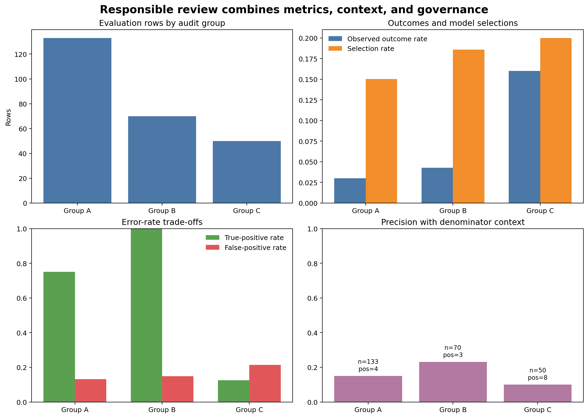

# Responsible Machine Learning and Model Governance {#sec-responsible-ml}

::: {.cdi-message}
- **ID:** MLPY-011
- **Type:** Responsible-ML assessment and governance chapter
- **Audience:** Learners evaluating whether a predictive workflow is appropriate, accountable, and safe to use
- **Theme:** Combine subgroup evidence, privacy controls, human oversight, documentation, and explicit limitations
:::

## Learning objectives

By the end of this chapter, you will be able to:

1. frame responsible machine learning across the full lifecycle;
2. evaluate selection rates and error rates across relevant groups;
3. explain why fairness criteria can conflict;
4. distinguish legitimate fairness auditing from inappropriate sensitive-feature use;
5. identify privacy, security, and human-oversight controls;
6. maintain a model risk register; and
7. document intended use, prohibited use, performance, and limitations in a model card.

## Responsibility is a system property

A technically accurate model can still cause harm when the target is inappropriate, data exclude important populations, decisions lack appeal, or predictions are used outside their validated purpose. Responsible practice begins before training and continues through retirement.

Ask throughout the lifecycle:

- Is the decision appropriate for machine assistance?
- Who benefits, who bears errors, and who can challenge a decision?
- Does the target represent the real objective?
- Are data collected and retained lawfully and proportionately?
- Does evaluation include affected groups and operational consequences?
- Can use be paused when assumptions fail?

::: callout-important
## Fairness is not one universal score

Different fairness definitions encode different values and may be mathematically incompatible when outcome rates differ. Choose evidence from the decision context, document trade-offs, and involve appropriate domain and stakeholder review.
:::

## Define the decision and harm model

Before calculating group metrics, document:

- decision supported by the model;
- benefit or resource being allocated;
- consequence of false positives and false negatives;
- groups potentially affected differently;
- source of historical labels;
- human review and appeal route; and
- prohibited uses.

A churn-risk model used to offer voluntary support differs ethically from the same score used to deny service. The numerical prediction is not the complete decision context.

## Group-level evaluation

The workbench retains an audit-only `access_group` field that is excluded from model features. It evaluates:

| Metric | Question |
|---|---|
| Base rate | How common is the observed outcome? |
| Selection rate | How often does the model issue a positive decision? |
| True-positive rate | Among positive cases, how many are identified? |
| False-positive rate | Among negative cases, how many are incorrectly flagged? |
| Precision | Among flagged cases, how many are positive? |
| ROC AUC | How well are cases ranked within the group? |

Always report group sample size and positive-case count. Small denominators produce unstable rates.

## A reproducible responsibility workbench

Run it from the repository root:

```bash
bash scripts/bash/11-run-responsible-ml-assessment.sh
```

The workflow writes:

```text
data/processed/11-responsible-ml-data.csv
results/figures/11-responsible-ml-assessment.png
results/tables/11-overall-performance.csv
results/tables/11-group-performance.csv
results/tables/11-fairness-comparisons.csv
results/tables/11-model-risk-register.csv
results/tables/11-governance-controls.csv
results/reports/11-model-card.md
```

{#fig-responsible-ml-assessment fig-alt="Four panels compare evaluation rows, outcome and selection rates, true-positive and false-positive rates, and precision across three audit groups." width=100%}

@fig-responsible-ml-assessment is a screening dashboard. Differences require investigation of data quality, base rates, threshold effects, sample size, and consequences; they are not automatic proof of fairness or discrimination.

## Calculate rates transparently

```python
true_positive_rate = true_positives / observed_positives
false_positive_rate = false_positives / observed_negatives
selection_rate = predicted_positives / group_rows
```

Use explicit zero-denominator handling and preserve the underlying counts. A rate without its numerator and denominator is easy to misinterpret.

## Compare groups carefully

The workflow reports differences relative to the largest evaluation group. A ratio near one means similar rates; a difference near zero means similar absolute rates. Neither establishes an acceptable result by itself.

Threshold changes can improve one criterion while worsening another. For example, increasing recall for a group may increase its false-positive rate. Review consequences rather than optimizing a parity statistic in isolation.

## Sensitive attributes

Excluding a sensitive attribute from training does not guarantee fairness. Other features can act as proxies, and historical labels may already reflect unequal processes.

Conversely, responsible auditing may require sensitive attributes to measure performance. Apply a documented lawful purpose, access restrictions, data minimization, retention limits, and appropriate review. Keep audit fields separated from ordinary prediction outputs when they are not needed operationally.

## Privacy and data minimization

Collect only information necessary for the defined purpose. Controls should address:

- purpose limitation and lawful basis;
- access by role;
- encryption and secure transfer;
- retention and deletion;
- logging without unnecessary raw features;
- re-identification risk in small groups;
- model and explanation leakage; and
- response to correction or deletion requests.

Synthetic data in this chapter demonstrate the workflow; they do not replace governance for real personal data.

## Human oversight

Human review is meaningful only when reviewers:

- have authority to change or stop the decision;
- receive relevant context rather than a score alone;
- understand model limitations;
- are not pressured to approve automatically;
- record reasons for overrides; and
- provide a route for affected people to question outcomes.

Monitor override rates and outcomes. Frequent overrides can reveal unclear policy, model weakness, or automation bias in either direction.

## Model risk register

The generated risk register records:

- risk statement;
- lifecycle stage;
- likelihood and impact;
- preventive or detective control;
- evidence produced;
- owner; and
- current status.

Examples include label bias, subgroup underperformance, privacy exposure, use outside scope, stale performance, and unreviewed automated action.

A register is valuable only when owners review and close actions. It should not become a static compliance document.

## Model card

The generated model card summarizes:

- model purpose and owner;
- intended and prohibited uses;
- training and evaluation design;
- feature and audit-field policy;
- overall and group-level metrics;
- threshold and human-review requirements;
- known limitations;
- monitoring expectations; and
- change history.

Documentation must match the actual artifact and workflow version. Update it when data, threshold, model, or intended use changes.

## Governance gates

A practical lifecycle includes approval gates:

1. **Problem approval:** decision, target, affected people, and alternatives reviewed.
2. **Data approval:** provenance, quality, privacy, and representativeness assessed.
3. **Model approval:** validation, subgroup evidence, interpretation, and limitations accepted.
4. **Release approval:** artifact, controls, human workflow, and rollback verified.
5. **Continued-use review:** monitoring and incidents reviewed on schedule.
6. **Retirement:** outputs, artifacts, access, and retention handled deliberately.

## Responsible-ML checklist

- [ ] Intended decision and affected stakeholders are documented.
- [ ] Target and labels are reviewed for harmful proxies or historical bias.
- [ ] Sensitive attributes have an approved training and audit policy.
- [ ] Overall metrics do not substitute for subgroup evaluation.
- [ ] Group counts and outcome counts accompany rates.
- [ ] Privacy controls cover data, predictions, logs, and explanations.
- [ ] Human review has authority, context, and an appeal path.
- [ ] Prohibited uses and stop conditions are explicit.
- [ ] Risks have owners, controls, evidence, and review dates.
- [ ] Documentation changes with the model and its use.

## Key takeaways

- Responsible machine learning concerns the decision system, not only the estimator.
- Fairness metrics express different values and can conflict.
- Group metrics require denominator counts, context, and uncertainty.
- Removing sensitive attributes does not remove proxy effects or historical bias.
- Privacy, security, human oversight, and appeal mechanisms are part of model quality.
- Risk registers and model cards turn assumptions and limitations into reviewable artifacts.
- High-impact use requires governance gates and authority to pause or retire the system.

## Looking ahead

The final professional step is to bring the complete lifecycle together. The next chapter develops an end-to-end machine-learning case study from problem definition and temporal validation through artifact creation, batch scoring, monitoring evidence, and a final handoff package.
