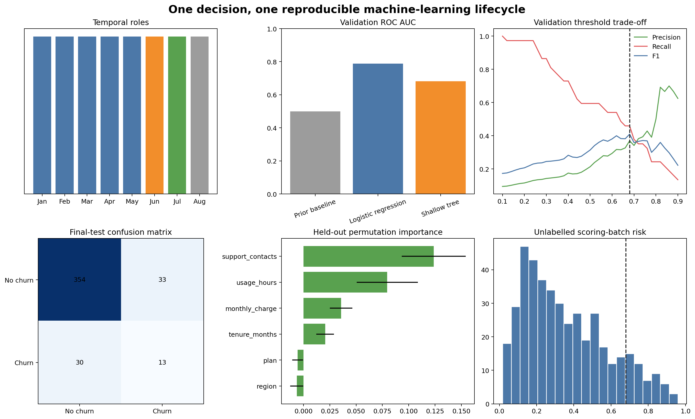

# End-to-End Machine Learning Case Study {#sec-end-to-end-case-study}

::: {.cdi-message}
- **ID:** MLPY-012
- **Type:** End-to-end professional machine-learning case study
- **Audience:** Learners integrating the complete workflow into one reproducible project
- **Theme:** Carry one prediction problem from decision framing to validated, governed, monitoring-ready handoff
:::

## Learning objectives

By the end of this chapter, you will be able to:

1. translate a decision into a prediction-time specification;
2. construct a temporally valid development, validation, and test design;
3. compare a baseline with simple candidate pipelines;
4. select a threshold on validation data and evaluate once on test data;
5. produce interpretation and subgroup evidence;
6. package a fitted artifact, schema, metadata, and scoring example; and
7. assemble a professional handoff with monitoring and governance requirements.

## Case study: monthly retention support

An organization wants to prioritize a limited number of customers for voluntary retention support.

The prediction specification is:

> At the end of each month, estimate whether an active customer will cancel during the following month using information available by the scoring cutoff.

The model does not decide whether service is denied, prices change, or an adverse action occurs. It ranks cases for human review and voluntary assistance.

### Unit, target, horizon, and action

| Element | Definition |
|---|---|
| Observation unit | One active customer at one monthly cutoff |
| Target | Cancellation during the following month |
| Prediction time | Final day of the current month |
| Horizon | One month |
| Action | Prioritized human review for optional support |
| Primary selection metric | Validation ROC AUC |
| Decision threshold | Selected on validation F1 for demonstration |
| Final evaluation | Untouched latest labelled month |

::: callout-important
## The deliverable is a controlled workflow

The fitted model is only one component. The professional output includes the data contract, evaluation evidence, threshold, artifact metadata, batch predictions, interpretation, subgroup checks, monitoring baseline, limitations, and owners.
:::

## The chronological design

The synthetic example contains eight monthly snapshots:

- months 1–5: training;
- month 6: validation and threshold selection;
- month 7: final labelled test;
- month 8: unlabelled scoring batch.

This sequence keeps model choice and threshold selection away from the final test outcomes and demonstrates how scoring continues before new labels mature.

## One command, complete evidence

Run the capstone from the repository root:

```bash
bash scripts/bash/12-run-end-to-end-ml-case-study.sh
```

The workflow writes:

```text
data/processed/12-customer-snapshots.csv
data/scoring/12-scoring-batch.csv
artifacts/12-retention-pipeline.joblib
artifacts/12-feature-schema.json
artifacts/12-model-metadata.json
results/figures/12-end-to-end-ml-case-study.png
results/tables/12-model-comparison.csv
results/tables/12-threshold-analysis.csv
results/tables/12-final-test-metrics.csv
results/tables/12-feature-importance.csv
results/tables/12-subgroup-performance.csv
results/tables/12-batch-predictions.csv
results/tables/12-monitoring-baseline.csv
results/reports/12-project-handoff.md
```

{#fig-end-to-end-case-study fig-alt="Six panels show the monthly train validation test and scoring design, model validation ROC AUC, precision recall and F1 across thresholds, final test confusion matrix, held-out permutation importance, and scoring-batch probability distribution." width=100%}

@fig-end-to-end-case-study is a compact review surface. The CSV, JSON, binary artifact, and handoff report preserve the detailed evidence.

## Stage 1: prepare the modelling table

The script generates repeated customer snapshots with numeric and categorical predictors, expected missing values, a binary future target, and an audit-only group field.

Preparation rules preserve the prediction-time boundary. The identifier, snapshot date, and audit group are excluded from modelling features but retained for splitting, traceability, and subgroup evaluation.

## Stage 2: build complete pipelines

Every candidate includes imputation, scaling, category encoding, and the estimator:

```python
workflow = make_pipeline(
    preprocessor,
    LogisticRegression(
        class_weight="balanced",
        max_iter=1000,
        random_state=42,
    ),
)
```

The candidate set deliberately remains small:

- prior-probability dummy baseline;
- logistic regression; and
- constrained decision tree.

The objective is disciplined comparison, not an exhaustive algorithm tournament.

## Stage 3: compare on validation data

All candidates train on the same early months and predict the same validation month. The comparison table records ROC AUC, balanced accuracy, and Brier score.

The selected model must:

- outperform the baseline on the primary metric;
- have probability error reviewed separately, with calibration required if probabilities will be interpreted literally;
- remain operationally supportable; and
- pass subgroup and interpretation review.

## Stage 4: select the operating threshold

The workflow selects a threshold on validation F1. This gives the capstone a reproducible rule, but the report states that a real threshold should incorporate contact capacity and the relative costs of false positives and false negatives.

The threshold is then frozen. It is not optimized against the test set.

## Stage 5: final test evaluation

The selected pipeline is refitted on training plus validation data and evaluated once on the final labelled month. Evidence includes:

- ROC AUC and average precision;
- accuracy and balanced accuracy;
- precision, recall, F1, and Brier score;
- confusion-matrix counts;
- row-level probabilities; and
- group-level metrics with denominators.

If final performance failed the acceptance criteria, artifact creation should stop. A real release gate would encode these criteria as assertions or approval checks.

## Stage 6: interpretation and responsible review

Held-out permutation importance tests which raw inputs support test-set ranking. The audit-only group field is used only for evaluation.

Interpretation remains predictive, not causal. Group differences remain review signals, not automatic fairness conclusions. The handoff identifies limitations and requires human review for all proposed actions.

## Stage 7: artifact and prediction contract

The script saves the complete selected pipeline with:

- feature schema;
- model and threshold version;
- training and test periods;
- final metrics;
- package versions; and
- artifact SHA-256 checksum.

As established in Chapter 08, load pickle-based artifacts only from trusted sources.

## Stage 8: score the unlabelled month

The latest month has no outcome labels. The workflow validates its required features, generates probabilities and deterministic prediction IDs, and records the model version.

No test metric is fabricated for this month. Instead, the scoring output and monitoring baseline prepare the project for later outcome matching.

## Stage 9: monitoring baseline

The monitoring table records reference values for:

- feature missingness;
- numeric mean and standard deviation;
- category proportions;
- probability mean and quantiles; and
- predicted-positive rate.

These values support future comparisons but do not replace versioned bin definitions and formal monitoring specifications in production.

## Stage 10: handoff

The generated project handoff summarizes:

- problem and intended action;
- data periods and split design;
- selected model and threshold;
- final performance;
- subgroup findings;
- artifact files and checksum;
- batch output;
- known limitations;
- monitoring expectations;
- owners and stop conditions; and
- prohibited uses.

## Acceptance checklist

- [ ] The decision, unit, target, cutoff, and horizon are explicit.
- [ ] All features are available at prediction time.
- [ ] Validation and test periods are separated chronologically.
- [ ] Preprocessing occurs inside every candidate pipeline.
- [ ] A meaningful baseline is included.
- [ ] Model and threshold selection use validation data only.
- [ ] Final test evaluation occurs once.
- [ ] Interpretation and group metrics retain appropriate caveats.
- [ ] Artifact, schema, metadata, checksum, and reference predictions agree.
- [ ] Unlabelled scoring data receive no invented performance score.
- [ ] Monitoring, human review, limitations, and stop conditions are documented.

## Key takeaways

- A professional ML project begins with a decision specification and ends with a governed handoff.
- Temporal roles for training, validation, testing, and future scoring protect evaluation integrity.
- Baselines, simple candidates, and complete pipelines create a defensible modelling core.
- Threshold selection is a separate validation decision from probability estimation.
- Interpretation, subgroup evaluation, privacy, and human oversight belong in the main workflow.
- Artifacts require schema, metadata, integrity checks, traceable predictions, and version compatibility.
- Monitoring evidence begins before new outcome labels mature.
- The best outcome is not always deployment; a clear decision to revise or stop is also professional success.

## Looking ahead

You now have the complete foundation for professional machine learning with Python. The appendix can provide quick-reference checklists, terminology, metric formulas, repository conventions, and a map from this guide to the separate model-deployment and models-to-systems guides.
